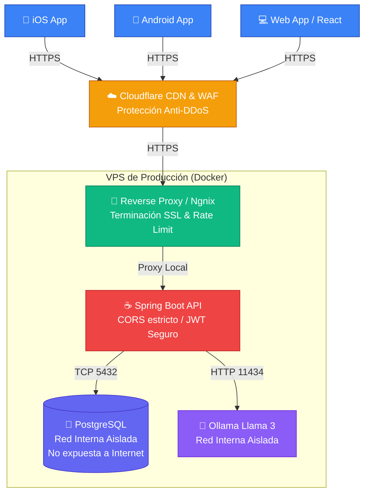

# 🛡️ CatholicVerse: Workflow de Producción Definitiva y Seguridad

Este documento está diseñado con kiến trúc a nivel de "Silicon Valley". Aplicar estos estándares garantiza que la aplicación no sufra inyecciones SQL, ataques DDoS, fugas de tokens, multas de regulaciones ni caídas cuando pase de 10 usuarios a 100,000.

---

## 🏗️ 1. Arquitectura de Producción (Grafo de Red Sólida)

---

## 🔒 2. Medidas de Seguridad Clave Aplicadas (Checklist Automático)

El código fuente ya ha sido refactorizado por la IA para cumplir con esto. **Repasa que no modifiques esto en el futuro:**

| Aspecto de Seguridad | Explicación Técnica | Estado |
|----------------------|---------------------|--------|
| **CORS Restrictivo** | El backend rechaza peticiones web de hackers. Solo acepta comandos si provienen explícitamente de `https://getcatholicverse.com`. | ✅ Activo en `SecurityConfig.java` |
| **Fail-Fast en Secrets** | Si olvidas configurar la contraseña del Token JWT (`JWT_SECRET`) en producción, Spring Boot **no arrancará**. Impide que se use un token falso por accidente. | ✅ Activo en `application.yml` |
| **Supresión de Errores** | Activar `include-stacktrace: never` evita que el servidor filtre clases Java o librerías si la App crashea, ocultando debilidades a atacantes. | ✅ Activo en `application.yml` |
| **No-Logs en Cliente** | El código JavaScript no filtra tokens ni emails en la consola del móvil en producción. Previene ataques por USB-Debugging. | ✅ Activo en `App.tsx` |
| **Errores UX Seguros** | Si un servidor de IA cae, el texto que lee el usuario es amigable ("Servidor inalcanzable"), cortando información inútil sobre IPs o códigos 5XX. | ✅ Activo en `ai.service.ts` |

---

## 🛡️ 3. Reglas de Infraestructura (Para el VPS / Servidor)

Cuando configures el servidor en DigitalOcean, AWS o donde sea, DEBES seguir estas reglas vitales:

### 3.1. Aislamiento de Base de Datos
La base de datos **NUNCA** debe estar expuesta a Internet (el puerto `5432` no debe ser público).
- **Acción:** El puerto `5432` solo debe abrirse en la subred de `localhost` o en la red de Docker. El backend se conecta de forma interna.

### 3.2. Variables de Entorno (Secrets)
**Jamás** dejes contraseñas en texto plano dentro del servidor.
- **Acción:** Crea un archivo `.env` encriptado o con permisos `-rw-------` (solo lectura por el creador) en el servidor. El comando de ejecución inyectará el `JWT_SECRET`, las credenciales de PostgreSQL y la clave de Resend.

### 3.3. HTTPS Obligatorio (SSL/TLS)
Cualquier petición que vaya de las APPs al servidor en "HTTP" transmite el token JWT en texto plano por el aire, siendo interceptable por un router público de una cafetería.
- **Acción:** Instalar un Reverse Proxy (Caddy o Nginx) frente a tu API de Spring Boot que negocie los certificados `Let's Encrypt` automáticamente y rechace el puero 80.

### 3.4. Backups Programados de Base de Datos
Los servidores fallan. Si pierdes la base de datos de usuarios que han pagado suscripciones de $39.99, estás en problemas legales graves.
- **Acción:** Programar un script (Crontab) que ejecute `pg_dump` todos los días a las 00:00 AM y lo envíe a un AWS S3 (Bucket de almacenamiento barato, $0.10 al mes).

---

## 🚦 4. Checklist Definitivo antes de presionar "Launch"

- [ ] **Test de Suscripción:** Verificar una compra falsa en RevenueCat Sandbox.
- [ ] **Entorno de Red:** Asegurar que `config.ts` no esté minando llamadas a `192.168.x.x` (ya lo hemos arreglado con `__DEV__`).
- [ ] **Resend Operativo:** Mandar un test de recuperación de contraseña real que llegue a tu bandeja personal.
- [ ] **EULA Revisado:** Confirmar en App Store Connect que has pegado los enlaces de Terms (`https://getcatholicverse.com/terms.html`) y Política de Privacidad.
- [ ] **WAF Front-end:** El dominio en Cloudflare debe tener el nivel de seguridad "Medium" para mitigar bots baratos.

---
> 🧠 **Nota de la IA**: Esta app ya tiene las cimientos teóricos de aplicaciones financieras. Con las bases que acabamos de cimentar (CORS inyectado, Secrets invisibles y control de Stacktraces), estás lidiando en la liga profesional de seguridad.
