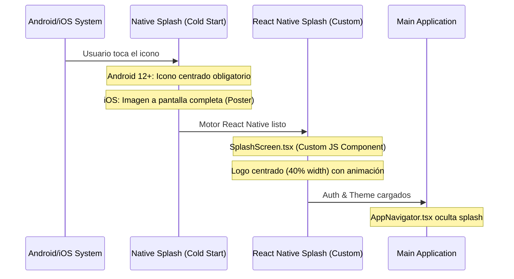

# 📱 Gestión de Assets y Splash Screens (Android vs iOS)

Este documento detalla la solución técnica implementada para unificar la experiencia visual de carga y los iconos en ambas plataformas, respetando las restricciones de Android 12+.

## 🛠 Arquitectura de Carga (Splash Screen)

Debido a las restricciones de la API de Android 12, se ha implementado un flujo de carga en dos etapas para garantizar una transición fluida.

### Decisiones de Diseño

1. **Native Splash Android**: Configurado con una imagen transparente (`assets/transparent-splash.png`) para evitar el "doble logo" y el salto de tamaños. El usuario ve el fondo de color liso (`#FAF9F6`) mientras el motor arranca.
2. **JS Splash (Custom)**: Implementado en `src/screens/SplashScreen.tsx`. Es el encargado de mostrar el logo con el tamaño deseado y realizar la transición suave hacia la app.
3. **Sincronización**: Se ha reducido el timeout en `AppNavigator.tsx` a **0ms** para que la transición desde la pantalla nativa en blanco a la pantalla de React sea lo más rápida posible.

## 🎨 Iconografía Adaptativa (Android)

Los iconos de Android requieren un "Safe Zone" del 66%. Se ha generado un script de Python para automatizar la creación del `adaptive-icon.png`.

| Parámetro | Valor | Razón |
| :--- | :--- | :--- |
| Tamaño Canvas | 1024x1024 | Estándar de alta resolución |
| Escala del Logo | 58% | Equilibrio entre visibilidad y margen de seguridad |
| Fondo | Transparente | Permite que el sistema aplique `backgroundColor` de app.json |

### Script de Generación
El script utiliza `Pillow` para centrar el `logo-transparent.png` original en un lienzo transparente, aplicando el padding necesario para que el sistema Android no corte los bordes del logo.
