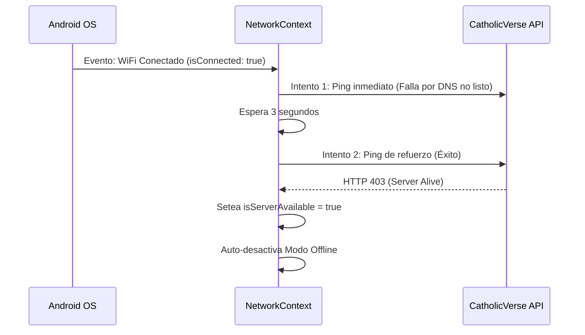
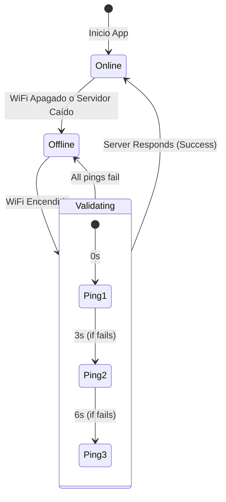

# 📡 Solución de Conectividad y Resiliencia en Android

Este documento detalla la arquitectura implementada para garantizar que la aplicación detecte cambios de red de forma instantánea y fiable en dispositivos Android, superando las limitaciones nativas de la plataforma y de la librería `@react-native-community/netinfo`.

## ⚠️ Limitaciones Nativas de Android
A diferencia de iOS, Android no realiza comprobaciones agresivas de "Internet Reachability" (alcanzabilidad real) en segundo plano. Esto causa:
1. **Falsos Positivos:** El sistema reporta `isConnected: true` solo por estar unido a un WiFi, aunque este no tenga salida a internet.
2. **Latencia en Re-conexión:** Al encender el WiFi, el flag `isInternetReachable` puede tardar hasta 30-60 segundos en actualizarse a `true`.
3. **Clausuras Obsoletas (Stale Closures):** Los listeners de red en React pueden quedar atrapados en estados antiguos del ciclo de vida, ignorando eventos sucesivos de toggle (apagar/encender rápido).

## 🛠️ Arquitectura de la Solución

Se ha implementado un sistema de **Verificación de Triple Capa** en el `NetworkContext.tsx`.

### 1. Configuración de NetInfo Agresiva
Se ha configurado la librería para realizar pings a los servidores de Google con tiempos de espera reducidos:
```typescript
NetInfo.configure({
  reachabilityUrl: 'https://clients3.google.com/generate_204',
  reachabilityLongTimeout: 30000, // 30s en reposo
  reachabilityShortTimeout: 5000, // 5s durante transiciones
  reachabilityRequestTimeout: 5000 // Timeout de 5s
});
```

### 2. Validación de Servidor (Fuente de Verdad Única)
La app no confía en los flags nativos de Android. En su lugar, realiza su propia validación contra el backend de CatholicVerse:
- **Endpoint:** `https://api.getcatholicverse.com/api/v1/health`
- **Método:** `HEAD` (ultra ligero, sin cuerpo de respuesta).
- **Frecuencia:** Cada 30 segundos (Equilibrio entre detección y escalabilidad).

### 3. Estrategia de Re-conexión en Android (Triple-Ping)
Para combatir el retraso de Android al negociar el WiFi, se ha implementado un sistema de reintentos programados:



### 4. Uso de Referencias (Refs) vs Estado
Para evitar que el listener de red use valores antiguos de `isConnected`, se ha migrado el estado crítico a `useRef`. Esto garantiza que los `setTimeout` y los reintentos siempre lean el estado real del hardware en ese microsegundo.

## 📉 Diagrama de Estados de Conectividad



## 🚀 Impacto en Escalabilidad
- **Peticiones HEAD:** Al no descargar datos, el impacto en el servidor es despreciable (~100 bytes por petición).
- **Ahorro de Batería:** Solo se realizan pings agresivos durante los primeros 6 segundos tras un cambio de red. El resto del tiempo se mantiene en un ciclo pasivo de 30s.
