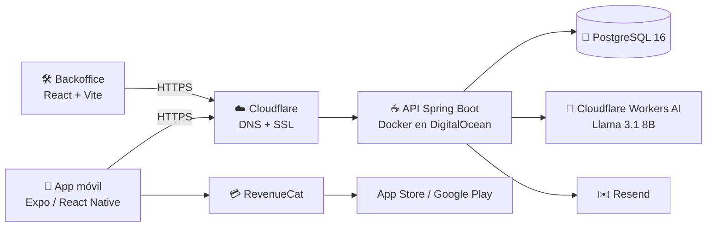

# 📖 CatholicVerse

**CatholicVerse** es una plataforma móvil premium para la comunidad católica: lectura completa de la Biblia (CPDV), lecturas litúrgicas diarias, asistente de IA bíblico, notas personales, favoritos, narración por voz offline y modo sin conexión — con suscripción gestionada por RevenueCat y prueba gratuita de 7 días.

🌐 Web oficial: [getcatholicverse.com](https://getcatholicverse.com)

---

## ✨ Características

- 📖 **Biblia Católica completa** — 73 libros, 1.189 capítulos, 31.102 versículos (CPDV), con búsqueda por texto y voz
- 🗓️ **Lectura litúrgica diaria** — año litúrgico completo, calendario de constancia y rachas de lectura
- 🤖 **Asistente de IA (RAG)** — responde preguntas citando versículos reales de la base de datos, con enlaces navegables al pasaje
- ✍️ **Escritos y favoritos** — notas personales vinculadas a versículos, etiquetas, subrayados por colores y reflexiones privadas
- 🔊 **Narrador con voz neuronal offline** — síntesis de voz local (sherpa-onnx + Piper), sin consumir datos
- ✈️ **Modo offline completo** — descarga de la Biblia entera y cola de sincronización automática al recuperar conexión
- 🔐 **Autenticación** — email/contraseña, Google Sign-In y Apple Sign-In, con JWT propio
- 💎 **Suscripción Premium** — App Store y Google Play vía RevenueCat, con trial de 7 días antifraude
- 🌗 **Modo claro/oscuro**, tipografía ajustable e interfaz bilingüe (ES/EN)

---

## 🏗️ Arquitectura del monorepo

| Proyecto | Qué es | Tecnología | Dónde corre |
|---|---|---|---|
| `BibliaAppExpo/` | App móvil | React Native 0.81 + Expo SDK 54 + TypeScript | iOS / Android (EAS Build) |
| `BibliaBackend/` | API REST | Java 21 + Spring Boot 3.2 (arquitectura hexagonal) + PostgreSQL 16 + Flyway | VPS DigitalOcean (Docker) |
| `CatholicVerseWeb/` | Web pública | HTML/CSS/JS estático | Cloudflare Pages |
| `CatholicVerseBackoffice/` | Panel de administración | React 19 + Vite + TypeScript | Cloudflare Pages |



Servicios externos: **Cloudflare Workers AI** (LLM para el asistente RAG), **RevenueCat** (suscripciones), **Resend** (emails transaccionales) y **Cloudflare** (DNS, SSL y Pages).

---

## 🚀 Inicio rápido

### Requisitos

Docker 20+, Java 21, Node.js 18+, Python 3.8+ (y Xcode / Android Studio para la app).

### Levantar el entorno de desarrollo

```bash
chmod +x *.sh        # solo la primera vez

./dev-start.sh       # PostgreSQL en Docker + API con hot-reload + Expo
./dev-stop.sh        # parar todo
```

La primera ejecución tarda unos minutos: Flyway crea el esquema (V1–V11) y un script de Python importa los 31.102 versículos automáticamente (no se repite).

### App móvil

```bash
cd BibliaAppExpo
npm install
npm run ios          # o: npm run android
```

> Usa módulos nativos (RevenueCat, TTS, Google Sign-In), así que requiere *development build* (`npx expo prebuild`) — no funciona en Expo Go.

### Desplegar a producción

```bash
cd BibliaBackend && ./mvnw clean install -DskipTests && cd ..
./prod-start.sh      # sube el JAR por scp al servidor y reinicia los contenedores
```

---

## 🛠️ Scripts de operación

| Script | ¿Para qué? |
|---|---|
| `dev-start.sh` / `dev-stop.sh` | Levantar / parar el entorno local |
| `dev-reload-api.sh` / `dev-reload-backend.sh` | Recargar la API tras cambios |
| `prod-start.sh` / `prod-stop.sh` | Desplegar / parar producción |
| `prod-reload-api.sh` / `prod-reload-backend.sh` | Recarga remota |
| `prod-logs.sh` / `grep-prod-logs.sh` / `prod-inspect*.sh` | Logs y diagnóstico remoto |

**URLs locales:** API `http://localhost:8080/api/v1` · Swagger `http://localhost:8080/api/v1/swagger-ui.html` · Health `http://localhost:8080/api/v1/actuator/health` · pgAdmin (dev) `http://localhost:5050`

**Producción:** API `https://api.getcatholicverse.com/api/v1` · Web `https://getcatholicverse.com`

---

## 📊 Estructura del proyecto

```text
Biblia/
│
├── BibliaBackend/                  # API REST (Spring Boot)
│   ├── src/main/java/              #   código en arquitectura hexagonal
│   ├── src/main/resources/db/      #   migraciones Flyway (V1-V11)
│   ├── scripts/                    #   importación de los 31.102 versículos
│   └── docker-compose.yml          #   PostgreSQL + API (+ pgAdmin en dev)
│
├── BibliaAppExpo/                  # App móvil (React Native + Expo)
│   ├── src/screens/                #   29 pantallas
│   ├── src/services/               #   18 servicios (API, caché, sync, TTS...)
│   ├── src/contexts/               #   estado global (auth, tema, red...)
│   └── src/navigation/             #   navegación tipada
│
├── CatholicVerseWeb/               # Web pública (landing, privacy, terms)
│
├── CatholicVerseBackoffice/        # Panel de administración (React + Vite)
│   └── src/pages/                  #   Dashboard, Users, Content, Logs, Settings
│
├── postman/                        # Colección Postman de la API
│
├── dev-start.sh ...                # scripts de desarrollo local
└── prod-start.sh ...               # scripts de despliegue a producción
```

---

## 🔌 La API en 30 segundos

API REST con context-path `/api/v1`, autenticación JWT (access 24 h / refresh 7 días) y Swagger integrado. Recursos principales: `auth` (registro, login, social, recuperación), `bible` (libros, capítulos, búsqueda, descarga offline), `chat` (asistente IA), `daily-reading`, `favorites`, `highlights`, `writings`, `reading-progress`, `users` y `admin`.

```bash
# Probar en local
curl http://localhost:8080/api/v1/actuator/health
curl http://localhost:8080/api/v1/bible/books
```

---

## 🆘 Problemas comunes

```bash
# Puerto 8080 ocupado
lsof -i :8080 && kill -9 <PID>

# Puerto 5432 ocupado (PostgreSQL local vs Docker)
docker-compose down

# El script de importación falla
pip3 install psycopg2-binary

# Resetear todo desde cero
./dev-stop.sh && rm -rf .dev-state .prod-state
cd BibliaBackend && docker-compose down -v && cd .. && ./dev-start.sh
```

---

**Licencia:** propietaria · **Bundle:** `com.catholicverse.app` · **Última actualización:** junio de 2026
