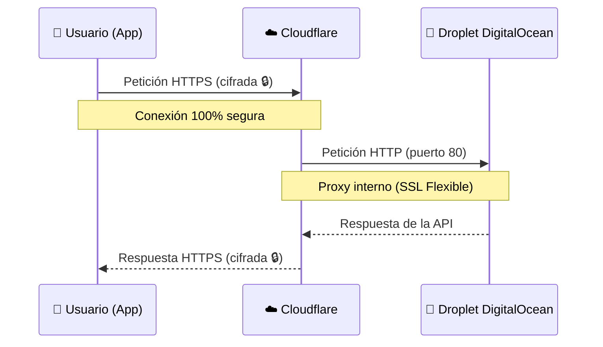

# 🌐 Arquitectura de Red, SSL y CORS (Cloudflare)

> **Documento consolidado (junio 2026).** Sustituye a `ARQUITECTURA_RED_Y_CLOUDFLARE.md`, `ARQUITECTURA_RED_Y_SEGURIDAD_SSL.md` y `EXPLICACION_CORS_Y_CONEXION.md` (archivados en `docs/historico/`). Verificado contra `application.yml`, `SecurityConfig.java` y `docker-compose.yml`.

---

## 1. El viaje de un dato

Cuando un usuario busca un versículo en la App, ocurre este viaje:

1. **📱 Móvil del Usuario:** La App llama a `https://api.getcatholicverse.com/api/v1/...`.
2. **☁️ Cloudflare (el recepcionista):** Recibe la llamada, aplica SSL/HTTPS y filtra ataques.
3. **🐳 DigitalOcean (el servidor):** Cloudflare reenvía la petición por HTTP al Droplet (`137.184.139.1`), donde Docker procesa la búsqueda y devuelve el versículo.

### ¿Por qué no ir directamente a la IP del servidor?

Usar Cloudflare como puente nos da tres superpoderes:

1. **🔐 SSL/HTTPS gratis y automático.** Apple y Google exigen tráfico cifrado; configurarlo a mano (Certbot/Nginx) consume RAM y puede fallar en renovaciones.
2. **🛡️ Protección e invisibilidad.** El atacante solo ve a Cloudflare; la IP real del Droplet queda oculta.
3. **🛠️ Mantenimiento sin dolor.** Si mañana cambiamos de proveedor de servidor, solo se actualiza la IP en el panel DNS de Cloudflare: la App publicada no necesita recompilarse porque siempre apunta al dominio, nunca a una IP.

---

## 2. Modelo SSL "Flexible"

- Usuario → Cloudflare: **cifrado** (candado verde siempre visible).
- Cloudflare → Droplet: **HTTP plano por el puerto 80** (no hay Nginx; Docker mapea 80→8080 directamente).
- Decisión consciente para ahorrar RAM en un servidor de 6 $/mes. Para una app bancaria sería inaceptable; para CatholicVerse es un estándar razonable de la industria.
- **Mejora futura planificada:** instalar un *Certificado de Origen* de Cloudflare en el servidor y pasar a modo **Full (Strict)** para cifrar también el tramo interno.

### Checklist de configuración actual

- **Puerto:** el servidor escucha en el **80** (mapeado al 8080 de la API en Docker).
- **Firewall DigitalOcean:** solo puertos **22 (SSH)** y **80 (HTTP)**.
- **DNS:** `api.getcatholicverse.com` → registro A a `137.184.139.1` con proxy activo (nube naranja).
- **SSL en Cloudflare:** modo **Flexible**.

---

## 3. Separación de canales web (público vs. privado)

| Web | Dominio | Propósito | Acceso |
|---|---|---|---|
| Web pública | `https://getcatholicverse.com` (+ `www`) | Escaparate: descarga de la app, términos, privacidad, marca | Público |
| Backoffice admin | `https://catholic-verse-admin.pages.dev` | Panel interno: estadísticas, logs, planes de usuarios, erratas de versículos | Privado (login `admin`; ver deuda técnica en la Documentación Maestra) |

Ambas se sirven gratis desde **Cloudflare Pages**.

---

## 4. CORS: cómo está configurado de verdad

Los navegadores aplican la *Same-Origin Policy*: si el backoffice (`catholic-verse-admin.pages.dev`) llama a `api.getcatholicverse.com`, el servidor debe declarar ese origen como confiable o el navegador bloquea la petición.

En `BibliaBackend/src/main/resources/application.yml` hay **tres perfiles** (`dev`, `docker`, `prod`) en un solo archivo multi-documento:

| Perfil | `cors.allowed-origins` | Swagger | `JWT_SECRET` |
|---|---|---|---|
| (por defecto) y `dev`/`docker` | `*` (todos los orígenes) | Activado | Tiene valor por defecto en el yml |
| `prod` | Lista blanca: `getcatholicverse.com`, `www.getcatholicverse.com`, `catholic-verse-admin.pages.dev`, `localhost:5173`, `localhost:3000` | **Desactivado** (`springdoc.enabled: false`) | **Sin fallback** — crashea si no se inyecta por entorno |

> ⚠️ **Matiz importante (verificado):** el `docker-compose.yml` que se despliega en producción arranca la API con `SPRING_PROFILES_ACTIVE: docker`, **no** `prod`. Es decir, las restricciones del perfil `prod` (CORS en lista blanca, Swagger apagado, JWT estricto) solo aplican si se cambia esa variable a `prod` en el servidor. Con el perfil `docker` activo, CORS efectivo es `*` y Swagger queda accesible. Esto está recogido como deuda técnica en `DOCUMENTACION_MAESTRA_2026.md`.

---

## 5. Diccionario rápido

- **`com.catholicverse.app`** — el "DNI" de la app en las tiendas (bundle ID, no es una dirección).
- **`api.getcatholicverse.com`** — el dominio que usa la App para hablar con el servidor.
- **IP (`137.184.139.1`)** — la dirección física real del Droplet en DigitalOcean.

> [!TIP]
> **Regla de oro:** en el código de la App nunca verás una IP, siempre el dominio. Así podemos cambiar de servidor sin romper la aplicación publicada.
