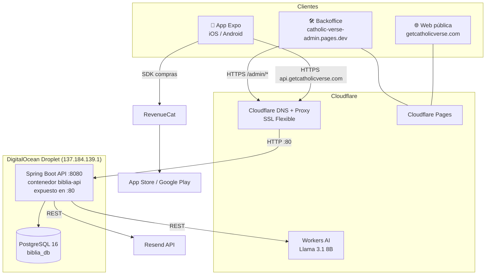
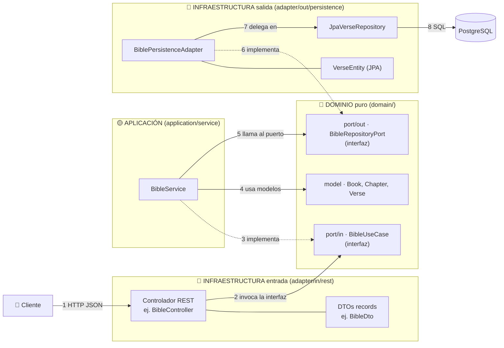
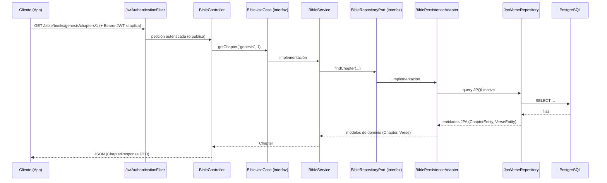
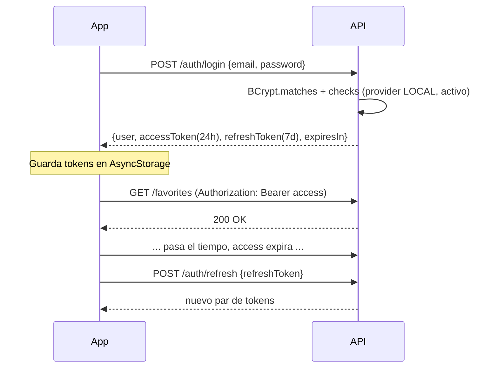
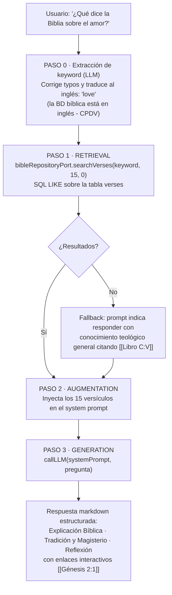
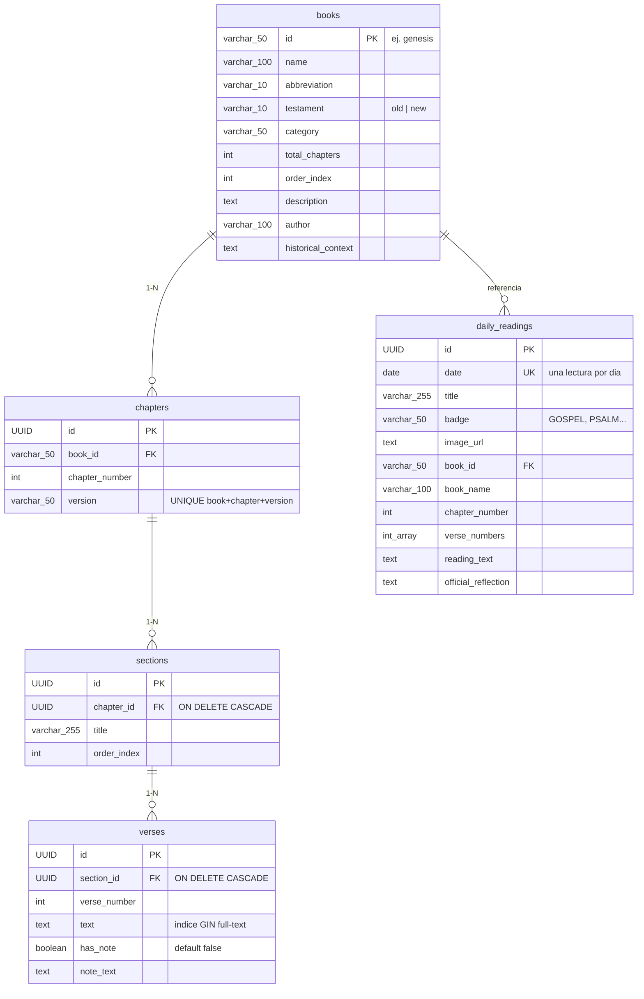
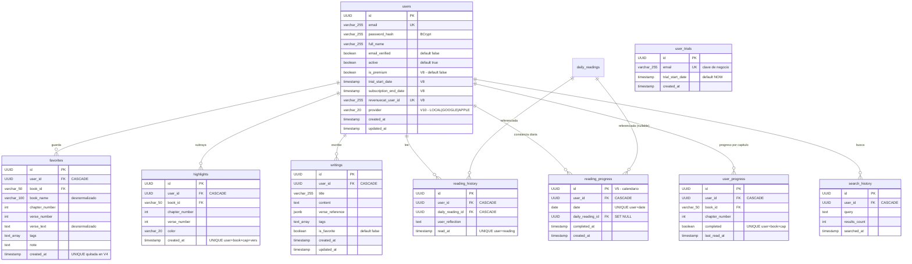
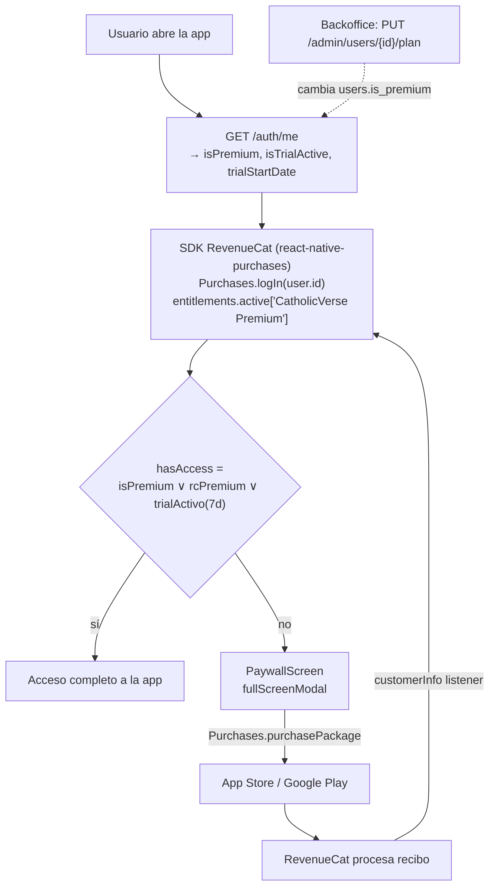
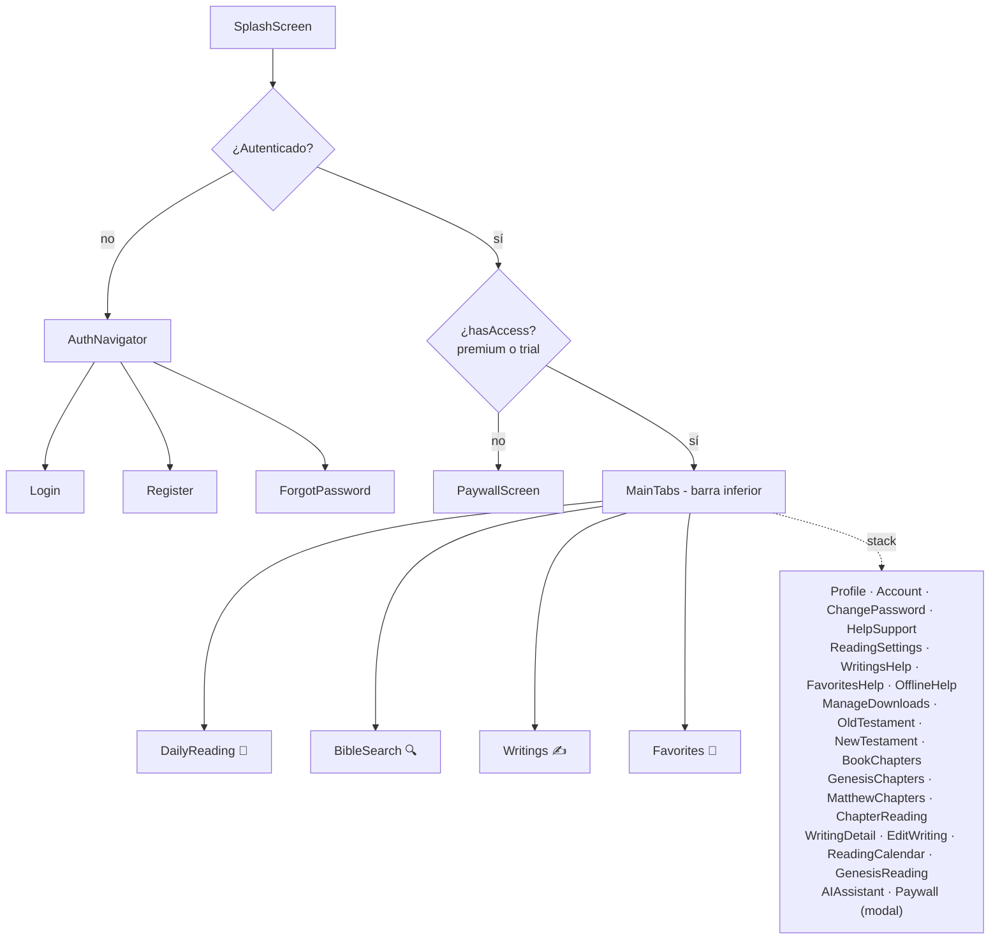
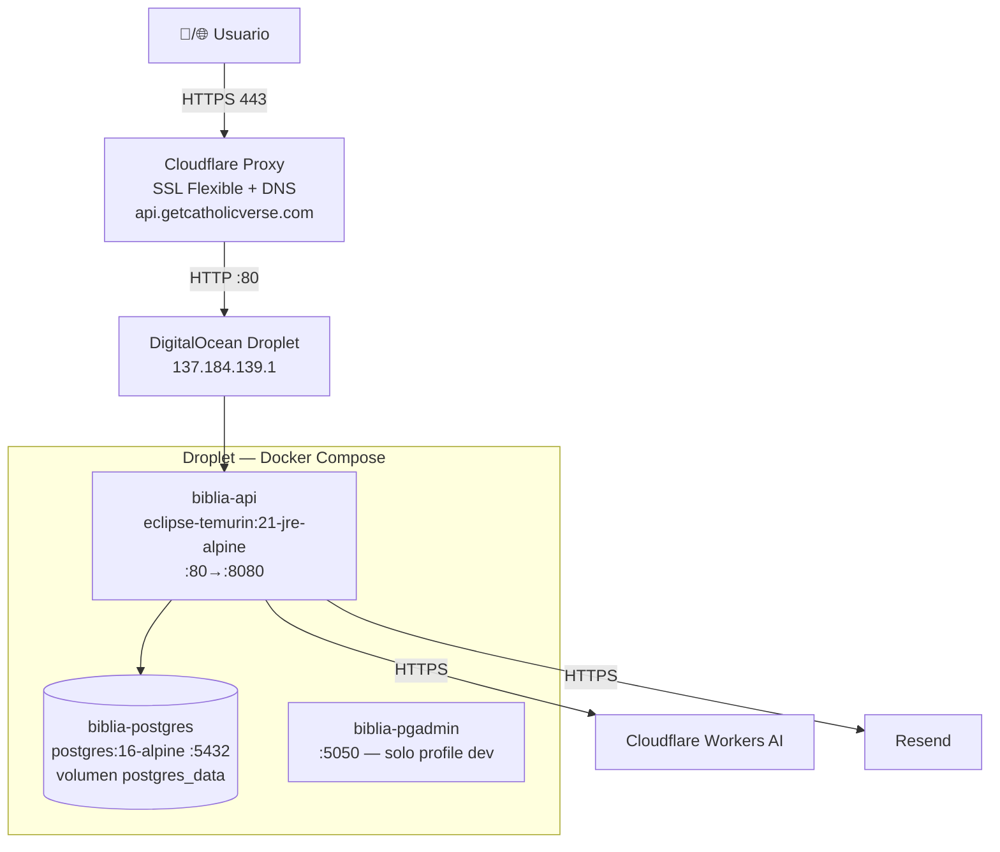

# 📖 CatholicVerse — Documentación Maestra (verificada contra el código, junio 2026)

> Este documento sustituye y corrige la documentación anterior. **Todo lo que aparece aquí ha sido verificado leyendo el código fuente real** de los 4 proyectos. Al final hay una sección con las correcciones a la documentación antigua.

---

## Índice

1. [Visión general del ecosistema](#1-visión-general-del-ecosistema)
2. [Backend Java — Arquitectura Hexagonal](#2-backend-java)
3. [API REST — Catálogo completo de endpoints](#3-api-rest--catálogo-completo-de-endpoints)
4. [Seguridad: JWT y Spring Security](#4-seguridad-jwt-y-spring-security)
5. [Autenticación: local, Google y Apple](#5-autenticación)
6. [Sistema RAG de IA](#6-sistema-rag-de-ia)
7. [Base de datos PostgreSQL](#7-base-de-datos-postgresql)
8. [Suscripciones, trial y RevenueCat](#8-suscripciones-trial-y-revenuecat)
9. [Emails transaccionales (Resend)](#9-emails-transaccionales-resend)
10. [App móvil React Native (Expo)](#10-app-móvil-react-native-expo)
11. [Modo offline y sincronización](#11-modo-offline-y-sincronización)
12. [Web pública](#12-web-pública)
13. [Backoffice de administración](#13-backoffice-de-administración)
14. [Infraestructura, red y despliegue](#14-infraestructura-red-y-despliegue)
15. [Correcciones a la documentación antigua](#15-correcciones-a-la-documentación-antigua)
16. [Deuda técnica y riesgos conocidos](#16-deuda-técnica-y-riesgos-conocidos)
17. [Preguntas y respuestas para la defensa](#17-preguntas-y-respuestas-para-la-defensa)

---

## 1. Visión general del ecosistema

CatholicVerse es una plataforma de lectura de la Biblia Católica con asistente de IA, compuesta por **4 piezas** + servicios externos:

| Pieza | Tecnología | Carpeta | Dónde corre |
|---|---|---|---|
| App móvil | React Native 0.81.5 + Expo SDK 54 + TypeScript | `BibliaAppExpo/` | iOS / Android (EAS Build) |
| Backend API | Java 21 + Spring Boot 3.2.5 | `BibliaBackend/` | DigitalOcean Droplet (Docker) |
| Web pública | HTML/CSS/JS estático | `CatholicVerseWeb/` | Cloudflare Pages |
| Backoffice admin | React 19 + Vite + TypeScript | `CatholicVerseBackoffice/` | Cloudflare Pages |

Servicios externos: **PostgreSQL 16** (misma máquina, contenedor Docker), **Cloudflare Workers AI** (LLM Llama 3.1 8B), **Resend** (emails), **RevenueCat** (suscripciones), **Cloudflare DNS/Proxy** (SSL y CDN).



**URL de producción de la API**: `https://api.getcatholicverse.com/api/v1` (context-path `/api/v1`).

---

## 2. Backend Java

### 2.1 Arquitectura Hexagonal (Ports & Adapters / Onion)

El código se organiza en tres capas concéntricas. La regla de oro: **las dependencias apuntan siempre hacia el centro** (el dominio). El dominio no importa nada de Spring, JPA ni HTTP.

Cómo se conecta todo (flechas numeradas = orden de una petición; punteadas = "implementa la interfaz"):



Camino de vuelta: filas SQL → entidades JPA → el adapter las convierte a modelos de dominio → el servicio los devuelve → el controlador los convierte a DTOs JSON. Ninguna capa salta a su no-vecina y el dominio solo expone interfaces.

```
com.bibliacatolica.api/
├── domain/                       ← NÚCLEO puro (sin Spring ni JPA)
│   ├── model/                    ← 16 modelos: User, Book, Chapter, Section, Verse,
│   │                                Favorite, Highlight, HighlightColor, Writing,
│   │                                DailyReading, ReadingHistory, ReadingProgress,
│   │                                UserProgress, SearchResult, Testament, BookCategory
│   ├── port/in/                  ← 9 casos de uso (interfaces): AuthenticationUseCase,
│   │                                BibleUseCase, BibleRagUseCase, DailyReadingUseCase,
│   │                                FavoriteUseCase, HighlightUseCase, WritingUseCase,
│   │                                ReadingProgressUseCase, UserUseCase
│   ├── port/out/                 ← 9 puertos de salida (repositorios): UserRepositoryPort,
│   │                                BibleRepositoryPort, UserTrialRepositoryPort, etc.
│   ├── service/                  ← Lógica de dominio pura (UserService, ReadingProgressService)
│   └── exception/                ← 5 excepciones de dominio
│
├── application/                  ← Implementaciones de casos de uso
│   └── service/                  ← AuthenticationService, BibleService, BibleRagService,
│                                    CloudflareAiClient, DailyReadingService, FavoriteService,
│                                    HighlightService, WritingService
│
└── infrastructure/               ← Adaptadores (todo lo externo)
    ├── adapter/in/rest/          ← 10 controladores REST + DTOs (records) + GlobalExceptionHandler
    ├── adapter/out/persistence/  ← 8 adaptadores + 12 entidades JPA + 11 repos Spring Data
    ├── adapter/out/email/        ← ResendEmailService
    └── config/                   ← security/ (JWT, SecurityConfig), web/ (OpenAPI), RestTemplateConfig
```

Los directorios `application/dto` y `application/mapper` **no existen como capa intermedia**: el mapeo dominio↔DTO se hace inline en los controladores (métodos privados `toBookDto()`, etc.) y dominio↔entidad JPA en los persistence adapters. Decisión deliberada para evitar sobre-ingeniería (triple mapeo `Domain↔AppDTO↔RestDTO` sin valor añadido).

### 2.2 Flujo de una petición (ejemplo: GET /bible/books/{id}/chapters/{n})



### 2.3 Dependencias clave (pom.xml)

Spring Boot 3.2.5, Java 21, spring-boot-starter-{web, data-jpa, security, validation, actuator}, PostgreSQL driver, Flyway (+ flyway-database-postgresql), JJWT (jjwt-api/impl/jackson), Lombok, MapStruct (declarado, mapeo principal manual), google-api-client 2.5.0 (verificación tokens Google), springdoc-openapi (Swagger), spring-ai-ollama-spring-boot-starter 1.0.0-M1 (proveedor IA local), H2 + Testcontainers para tests.

### 2.4 Configuración (application.yml)

- `server.servlet.context-path: /api/v1`, puerto 8080.
- JPA `ddl-auto: validate` → el esquema lo gobierna **Flyway**, Hibernate solo valida.
- Flyway con `baseline-on-migrate: true`, `validate-on-migrate: false`, `out-of-order: true`.
- JWT: expiración access 86 400 000 ms (24 h), refresh 604 800 000 ms (7 días). Secret por env `JWT_SECRET` (tiene valor por defecto en el yml — ver deuda técnica).
- CORS: `cors.allowed-origins` (por defecto `*`).
- **Perfiles**: el `application.yml` es multi-documento con perfiles `dev`, `docker` y `prod`. El perfil `prod` endurece todo (Swagger desactivado, CORS en lista blanca con los dominios de getcatholicverse.com y el backoffice, `JWT_SECRET` sin fallback). **Pero el docker-compose desplegado arranca con `SPRING_PROFILES_ACTIVE: docker`**, así que ese endurecimiento no está activo en el servidor a menos que se cambie la variable a `prod` (ver deuda técnica).
- IA: `spring.ai.provider` = `cloudflare` (defecto) u `ollama`; modelo Cloudflare `@cf/meta/llama-3.1-8b-instruct`; Ollama local `llama3.2:1b`.
- Resend: `RESEND_API_KEY`, from `catholicverse@getcatholicverse.com`.
- Actuator: expone `health`, `info`, `metrics`.

---

## 3. API REST — Catálogo completo de endpoints

Base: `/api/v1`. 🔓 = público (sin JWT), 🔐 = requiere `Authorization: Bearer <accessToken>`.

### AuthController — `/auth` (todo 🔓)

| Método | Ruta | Función |
|---|---|---|
| POST | `/auth/register` | Registro (email, password, fullName). Crea trial, envía email de bienvenida, devuelve user + tokens |
| POST | `/auth/login` | Login local. Rechaza cuentas GOOGLE/APPLE con mensaje específico |
| POST | `/auth/refresh` | Nuevo par de tokens a partir del refreshToken |
| POST | `/auth/logout` | Invalida el token (blacklist en memoria) |
| GET | `/auth/me` | Usuario actual (incluye `isPremium`, `isTrialActive`, `trialStartDate`) |
| POST | `/auth/forgot-password` | Genera código de 6 dígitos y lo envía por email (no revela si el email existe) |
| POST | `/auth/verify-reset-code` | Verifica el código |
| POST | `/auth/reset-password` | Cambia la contraseña si el código es válido |
| POST | `/auth/google` | Login con idToken de Google (verificación de firma real) |
| POST | `/auth/apple` | Login con identityToken de Apple (decodificación sin verificar firma) |

### BibleController — `/bible`

| Método | Ruta | Acceso | Función |
|---|---|---|---|
| GET | `/bible/books` | 🔓 | Los 73 libros agrupados en AT/NT |
| GET | `/bible/books/old-testament` | 🔓 | 46 libros del AT |
| GET | `/bible/books/new-testament` | 🔓 | 27 libros del NT |
| GET | `/bible/books/{bookId}` | 🔓 | Detalle de un libro |
| GET | `/bible/books/{bookId}/chapters/{n}` | 🔓 | Capítulo con secciones y versículos (param opcional `version`) |
| GET | `/bible/search` | 🔓 | Búsqueda por texto (`query`, `testament`, `bookIds`, `page`, `pageSize`) |
| GET | `/bible/english/download` | 🔓 | **Biblia completa en un JSON** para modo offline (header `Content-Disposition: attachment`) |

### AIChatController — `/chat` (🔓 — ver deuda técnica)

| Método | Ruta | Función |
|---|---|---|
| POST | `/chat` | Pregunta al asistente RAG. Respuesta markdown con enlaces `[[Libro Cap:Vers]]` |

### DailyReadingController — `/daily-reading` (GET 🔓, POST 🔐)

| Método | Ruta | Función |
|---|---|---|
| GET | `/daily-reading/today` | Lectura litúrgica de hoy |
| GET | `/daily-reading/{date}` | Lectura de una fecha |
| GET | `/daily-reading/week` | Lecturas de la semana |
| GET | `/daily-reading/history` | Historial del usuario |
| GET | `/daily-reading/status` | Estado de lectura |
| POST | `/daily-reading/{readingId}/mark-read` | Marcar como leída |
| POST | `/daily-reading/{readingId}/reflection` | Guardar reflexión personal |

### FavoriteController — `/favorites` 🔐

GET `/favorites` · POST `/favorites` · PUT `/favorites/{id}` · DELETE `/favorites/{id}` · GET `/favorites/check`

### HighlightController — `/highlights` 🔐

GET `/highlights` · GET `/highlights/chapter` · POST `/highlights` · DELETE `/highlights/{id}` · DELETE `/highlights` (por versículo)

### WritingController — `/writings` 🔐 (notas personales)

GET `/writings` · GET `/writings/{id}` · POST `/writings` · PUT `/writings/{id}` · PATCH `/writings/{id}/favorite` · DELETE `/writings/{id}`

### ReadingProgressController — `/reading-progress` 🔐

POST (marcar capítulo leído) · DELETE (desmarcar) · GET (progreso) · GET `/streak` (racha de días) · GET `/check`

### UserController — `/users` 🔐

PUT `/users/me` (perfil) · PUT `/users/me/password` · DELETE `/users/me` (borrar cuenta)

### AdminController — `/admin` (🔓 a nivel de Spring Security — protegido solo por el login del backoffice)

| Método | Ruta | Función |
|---|---|---|
| GET | `/admin/users` | CRM: lista de usuarios con plan |
| PUT | `/admin/users/{userId}/plan` | Cambiar plan Premium/Free manualmente |
| DELETE | `/admin/users/{userId}` | Borrado GDPR del usuario |
| GET | `/admin/daily-readings` | CMS: listar lecturas litúrgicas |
| POST | `/admin/daily-readings` | CMS: crear/actualizar lectura de una fecha |
| DELETE | `/admin/daily-readings/{date}` | CMS: borrar lectura |
| PUT | `/admin/bible/verses` | Corregir erratas de versículos directamente en BD |
| GET | `/admin/dashboard-stats` | Métricas: usuarios totales/premium reales; "active now" y "AI queries" son **estimadores calculados**, no contadores reales |
| GET | `/admin/audit-logs` | Pseudo-logs construidos a partir de registros reales (users, writings, favorites), limitados a 50 |

### Manejo de errores

`GlobalExceptionHandler` (`@RestControllerAdvice`) traduce las excepciones de dominio (`AuthenticationException`, `ResourceNotFoundException`, `DuplicateResourceException`, `BusinessRuleException`) a respuestas HTTP coherentes (401/404/409/400).

---

## 4. Seguridad: JWT y Spring Security

### 4.1 SecurityFilterChain (código real)

- CSRF deshabilitado, sesiones **STATELESS**, CORS configurable.
- Públicos: `/auth/**`, swagger (`/swagger-ui/**`, `/api-docs/**`), `/actuator/health`, `POST /chat`, **`/admin/**`**, `GET /bible/books/**`, `GET /bible/search/**`, `GET /bible/english/download`, `GET /daily-reading/**`.
- Todo lo demás: autenticado vía `JwtAuthenticationFilter` (se ejecuta antes de `UsernamePasswordAuthenticationFilter`).
- Passwords con **BCrypt**.

### 4.2 JwtTokenProvider

- Firma **HMAC-SHA** con clave derivada de `JWT_SECRET` (Base64 → `Keys.hmacShaKeyFor`).
- **AccessToken (24 h)**: claims `sub` (userId), `email`, `name`, `type=access`.
- **RefreshToken (7 días)**: claims `sub`, `type=refresh`.
- `validateToken()` comprueba firma, expiración y blacklist en memoria (`Set<String> invalidatedTokens` — se pierde al reiniciar; mejora propuesta: Redis/BD).



---

## 5. Autenticación

### 5.1 Registro local
1. Comprueba email duplicado → `DuplicateResourceException` (409).
2. **Trial persistente por email**: busca en `user_trials`; si no existe, guarda `NOW()`. Si el usuario borra su cuenta y se vuelve a registrar, **el trial no se reinicia**.
3. Crea `User` (UUID, BCrypt, `provider=LOCAL`, `emailVerified=true` — sin verificación real por ahora).
4. Envía email de bienvenida (Resend) y devuelve tokens.

### 5.2 Google Sign-In (`POST /auth/google`)
- `GoogleIdTokenVerifier` (librería oficial) **verifica la firma criptográficamente** contra los servidores de Google, validando el audience (IDs de cliente Web/iOS/Android del proyecto Firebase `catholicverse-40437`).
- Extrae email + nombre del payload → `processSocialLogin(email, name, "GOOGLE")`.

### 5.3 Apple Sign-In (`POST /auth/apple`)
- Decodifica el JWT **sin verificar la firma** (se separa header.payload y se parsea). Limitación conocida y documentada en el código; producción estricta usaría las claves públicas de `https://appleid.apple.com/auth/keys`.

### 5.4 processSocialLogin (común)
- Si el email no existe → crea usuario con contraseña aleatoria bloqueada (UUID encriptado con BCrypt) y trial persistente.
- Si existe con otro provider → **actualiza el provider** (un usuario local que entra con Google pasa a GOOGLE).
- Genera tokens propios de CatholicVerse (el cliente nunca usa el token de Google/Apple contra la API).

### 5.5 Recuperación de contraseña
Código aleatorio de 6 dígitos guardado en un `ConcurrentHashMap<email, code>` **en memoria** (sin TTL; se pierde al reiniciar; mejora propuesta: Redis o tabla con expiración). Flujo: forgot → email Resend → verify-reset-code → reset-password (invalida el código).

---

## 6. Sistema RAG de IA

`BibleRagService` implementa **Retrieval-Augmented Generation** en 4 pasos (hay un paso 0 previo al RAG clásico):



### Detalles importantes del system prompt
- Responde **en el idioma del usuario**.
- Tono pastoral, riguroso, nunca en primera persona como Dios/sacerdote.
- Estructura fija en 3 secciones markdown.
- **Enlaces interactivos obligatorios**: toda referencia bíblica va entre `[[ ]]` (p. ej. `[[Mateo 5:3]]`). La app los parsea con `MessageParser.tsx` y los convierte en enlaces navegables al capítulo/versículo.

### Sistema dual de proveedores

| | Cloudflare Workers AI (prod) | Ollama (dev local) |
|---|---|---|
| Modelo | `@cf/meta/llama-3.1-8b-instruct` | `llama3.2:1b` |
| Cómo | `CloudflareAiClient` → REST `api.cloudflare.com/client/v4/accounts/{id}/ai/run/{model}` | Spring AI `ChatClient` → `http://biblia-ollama:11434` |
| Selección | `SPRING_AI_PROVIDER=cloudflare` (defecto) | `SPRING_AI_PROVIDER=ollama` |
| Estado | Activo en producción | Contenedor **comentado en docker-compose para ahorrar RAM** |

Errores del LLM devuelven un mensaje controlado de "servidor de IA no disponible" en lugar de un 500.

> Nota: el endpoint `POST /chat` es público (sin JWT). El control de acceso premium se hace en la app (Paywall), no en la API.

---

## 7. Base de datos PostgreSQL

### 7.1 Modelo de datos

La BD tiene **14 tablas**. Modelo completo (todas las columnas, verificadas en las migraciones), dividido en dos diagramas para legibilidad.

#### Contenido bíblico y litúrgico



#### Usuarios y actividad



Tablas de V1: `users`, `books`, `chapters`, `sections`, `verses`, `favorites`, `highlights`, `writings`, `daily_readings`, `reading_history`, `user_progress`, `search_history`. Añadidas después: `reading_progress` (V5), `user_trials` (V9).

**Decisiones de diseño defendibles**: (1) `favorites` desnormaliza `book_name` y `verse_text` para evitar JOINs en la pantalla de favoritos; (2) `ON DELETE CASCADE` desde `users` = borrado GDPR completo; (3) `reading_progress.daily_reading_id` es `SET NULL` para no perder la constancia del calendario si se borra una lectura; (4) `user_trials` usa el email como clave separada de `users` justamente para sobrevivir al borrado de cuenta; (5) hay dos progresos distintos: `user_progress` (capítulos leídos) y `reading_progress` (días de lectura diaria completados).

**Jerarquía del texto bíblico**: `books → chapters → sections → verses`. Las *sections* subdividen capítulos con títulos temáticos. Los capítulos llevan campo `version` (UNIQUE book+chapter+version), lo que permite varias traducciones.

### 7.2 Las 11 migraciones Flyway

| V | Archivo | Qué hace |
|---|---|---|
| 1 | initial_schema | 12 tablas + índices (incluye GIN full-text sobre verses.text) |
| 2 | seed_books | Inserta los 73 libros católicos |
| 3 | seed_daily_readings | Lecturas diarias iniciales |
| 4 | remove_favorite_unique_constraint | Permite favoritos duplicados |
| 5 | create_reading_progress | Tabla de progreso por capítulo/fecha |
| 6 | translate_books_to_english | Contenido al inglés (CPDV) para la búsqueda RAG |
| 7 | translate_chapter_version_and_badges | Versiones de capítulos y badges |
| 8 | add_subscription_fields_to_users | `is_premium`, `subscription_end_date`, `revenuecat_user_id` |
| 9 | create_user_trials_table | Trial persistente por email |
| 10 | add_provider_to_users | LOCAL / GOOGLE / APPLE |
| 11 | seed_365_daily_readings | Año litúrgico completo |

### 7.3 Búsqueda

La búsqueda actual (`JpaVerseRepository.searchByText`) usa SQL nativo con `LOWER(text) LIKE %query%` (+ match exacto por book_id), con `LIMIT/OFFSET`. Existe un índice GIN `to_tsvector('spanish', text)` creado en V1, pero la consulta actual no lo aprovecha (mejora futura: full-text search real).

---

## 8. Suscripciones, trial y RevenueCat

### 8.1 La verdad del código (importante)

**No existe webhook de RevenueCat en el backend.** El acceso premium se determina así:

```
hasAccess = isPremium OR isTrialActive

isPremium      = backend (users.is_premium) OR RevenueCat SDK (entitlement "CatholicVerse Premium" activo)
isTrialActive  = backend: NOW() < trial_start_date + 7 días   (User.isTrialActive(), dominio Java)
```



- **Trial**: 7 días, calculado en el dominio (`User.isTrialActive()`); fecha persistida por email en `user_trials` para que no se reinicie al re-registrarse.
- **Compra**: la maneja íntegramente el SDK de RevenueCat en el cliente (`SubscriptionContext`): `configure(apiKey)` → `logIn(user.id)` → `getOfferings()` → `purchasePackage()` / `restorePurchases()`. Las API keys vienen de `EXPO_PUBLIC_REVENUECAT_APPLE_KEY` / `_GOOGLE_KEY`.
- **Backend manual**: el admin puede dar/quitar Premium desde el backoffice (sin pasarela).
- La tabla `users` tiene `revenuecat_user_id` y `subscription_end_date` preparados para una futura integración server-side (webhook), aún no implementada.

---

## 9. Emails transaccionales (Resend)

`ResendEmailService` (adaptador de salida) llama a `https://api.resend.com/emails` vía `RestTemplate` con `Authorization: Bearer ${RESEND_API_KEY}`. Remitente: `CatholicVerse <catholicverse@getcatholicverse.com>`.

| Email | Cuándo | Asunto |
|---|---|---|
| Bienvenida | Al registrarse (local) | "Welcome to CatholicVerse ✝" |
| Reset password | Al pedir recuperación | "Your CatholicVerse password reset code" (código de 6 dígitos) |

Plantillas HTML inline con branding dorado (#d4af37) y enlaces a privacy/terms.

---

## 10. App móvil React Native (Expo)

### 10.1 Stack

Expo SDK 54 · React Native 0.81.5 · React 19.1 · TypeScript · React Navigation 7 (native-stack + bottom-tabs) · AsyncStorage 2.2 · react-native-purchases 10 (RevenueCat) · expo-speech (TTS) · expo-speech-recognition (dictado) · expo-file-system (Biblia offline) · expo-apple-authentication + expo-auth-session (social login) · i18n propio (`src/locales`, ES/EN) · EAS Build (`eas.json`) · bundle `com.catholicverse.app`.

### 10.2 Estructura

```
src/
├── navigation/AppNavigator.tsx   ← raíz de navegación
├── screens/        (29 pantallas)
├── services/       (18 servicios) ← toda la lógica de datos
├── contexts/       (5 contextos)  ← estado global
├── components/     (9 componentes transversales)
├── hooks/useOfflineBible.ts
├── locales/ (es, en, i18n)
├── theme/colors.ts · constants/ · data/chapterTitles.ts · utils/validation.ts
```

### 10.3 Navegación



Las 4 pestañas: **DailyReading** (lectura litúrgica del día), **BibleSearch** (explorador AT/NT + buscador), **Writings** (notas personales), **Favorites** (versículos guardados).

### 10.4 Pantallas (29)

| Grupo | Pantallas |
|---|---|
| Auth | Login, Register, ForgotPassword, Splash |
| Lectura | DailyReading, ReadingCalendar, OldTestament, NewTestament, BookChapters, GenesisChapters, MatthewChapters, ChapterReading, GenesisReading |
| Contenido personal | Writings, WritingDetail, EditWriting, Favorites |
| IA | AIAssistant (chat con el RAG, enlaces [[...]] navegables) |
| Cuenta | Profile, Account, ChangePassword, ReadingSettings |
| Ayuda | HelpSupport, WritingsHelp, FavoritesHelp, OfflineHelp |
| Offline | ManageDownloads |
| Monetización | Paywall |

### 10.5 Servicios (18)

| Servicio | Responsabilidad |
|---|---|
| `api.client.ts` | Singleton HTTP: añade `Bearer` desde AsyncStorage, timeout 4 s (∞ para IA), manejo de errores de red |
| `config.ts` | URL base: prod `https://api.getcatholicverse.com/api/v1`; web dev `localhost:8080` |
| `auth.service.ts` | register/login/refresh/me + Google/Apple |
| `bible.service.ts` | Libros, capítulos, búsqueda |
| `ai.service.ts` | POST /chat |
| `daily-reading.service.ts` | Lecturas diarias + mark-read + reflexión |
| `favorites.service.ts` / `highlights.service.ts` / `writings.service.ts` | CRUD respectivos |
| `reading-progress.service.ts` / `reading-history.service.ts` | Progreso y racha |
| `cache.service.ts` | Capa de caché AsyncStorage + cola `PENDING_SYNC` |
| `sync.service.ts` | Reintenta operaciones pendientes al volver online (writings, favorites, progress) y reconcilia IDs temporales→reales |
| `english-bible-download.service.ts` | Descarga `bible_offline.json` a `FileSystem.documentDirectory` con progreso |
| `smart-search.service.ts` | Búsqueda avanzada con filtros |
| `audio.service.ts` | TTS con expo-speech (play/pause/resume/stop) |
| `share.service.ts` | Compartir versículos |
| `revenuecatConfig.ts` | API keys RevenueCat por plataforma |

### 10.6 Contextos (5)

| Contexto | Gestiona |
|---|---|
| `AuthContext` | Usuario, tokens, login/logout, restauración de sesión |
| `SubscriptionContext` | `hasAccess` (premium backend ∨ RevenueCat ∨ trial), paquetes, compra, restore |
| `ThemeContext` | Modo claro/oscuro |
| `NetworkContext` | Online/offline (alimenta OfflineBanner y sync) |
| `TextSettingsContext` | Tamaño y tipo de fuente de lectura |

---

## 11. Modo offline y sincronización

```mermaid
flowchart LR
    subgraph Descarga
        MD[ManageDownloadsScreen] -->|GET /bible/english/download| API
        API -->|bible_offline.json| FS[expo-file-system<br/>documentDirectory]
        FS --> FLAG[AsyncStorage:<br/>@english_bible_offline_downloaded]
    end
    subgraph Lectura offline
        NC[NetworkContext detecta offline] --> HOOK[useOfflineBible]
        HOOK --> FS
        NC --> CACHE[cache.service: writings/favorites/daily readings cacheados]
    end
    subgraph Escritura offline
        OP[Crear nota / favorito sin conexión] --> QUEUE[cola PENDING_SYNC<br/>con IDs temporales]
        NC2[Vuelve la conexión] --> SYNC[sync.service.syncAll]
        SYNC -->|reintenta contra la API| API
        SYNC --> IDS[Reemplaza IDs temporales por reales en caché]
    end
```

- La Biblia completa se guarda como **archivo JSON** (no AsyncStorage, por tamaño); un flag en AsyncStorage marca la descarga.
- Lecturas diarias cacheadas con expiración; limpieza de entradas de más de 7 días.
- Operaciones fallidas se re-encolan; `getPendingCount()` alimenta la UI.

---

## 12. Web pública

`CatholicVerseWeb/` — **HTML/CSS/JS estático sin framework**: `index.html` (landing de marketing), `privacy.html`, `terms.html` (requisitos de App Store / Google Play). Desplegada en **Cloudflare Pages** con dominio `getcatholicverse.com` (deploy automático con git push, CDN y HTTPS gratis).

---

## 13. Backoffice de administración

`CatholicVerseBackoffice/` — React 19 + Vite + TypeScript, desplegado en Cloudflare Pages (`catholic-verse-admin.pages.dev`).

| Página | Función | Endpoint que consume |
|---|---|---|
| Login | Credenciales **hardcodeadas en el cliente** (`admin` / `catholicadmin`) — ver deuda técnica | — |
| Dashboard | Métricas y distribución de usuarios | GET /admin/dashboard-stats |
| Users | CRM: listar, cambiar plan, borrar (GDPR) | GET/PUT/DELETE /admin/users… |
| Content | CMS de lecturas litúrgicas + corrección de erratas de versículos | /admin/daily-readings, PUT /admin/bible/verses |
| Logs | Registro de actividad (construido desde datos reales) | GET /admin/audit-logs |
| Settings | URL del backend configurable (localStorage `springBootUrl`) | — |

---

## 14. Infraestructura, red y despliegue

### 14.1 Producción



- **SSL Flexible de Cloudflare**: usuario→Cloudflare va cifrado (candado verde); Cloudflare→Droplet va por HTTP puerto 80. **No hay Nginx**: Docker mapea 80→8080 directamente. Decisión consciente para ahorrar RAM/complejidad; plan futuro: certificado de origen de Cloudflare (Full Strict).
- Firewall DigitalOcean: solo 22 (SSH) y 80 (HTTP).
- Ollama está **comentado** en docker-compose (ahorro de RAM): la IA en producción es 100 % Cloudflare Workers AI.

### 14.2 Variables de entorno de producción

| Variable | Uso |
|---|---|
| `POSTGRES_USER` / `POSTGRES_PASSWORD` | Credenciales BD |
| `JWT_SECRET` | Firma de tokens |
| `RESEND_API_KEY` | Emails |
| `SPRING_AI_PROVIDER` | cloudflare / ollama |
| `CLOUDFLARE_ACCOUNT_ID` / `CLOUDFLARE_API_TOKEN` / `CLOUDFLARE_AI_MODEL` | Workers AI |
| `EXPO_PUBLIC_REVENUECAT_APPLE_KEY` / `_GOOGLE_KEY` | (app) SDK RevenueCat |

### 14.3 Scripts de operación (raíz del repo)

| Script | Qué hace |
|---|---|
| `dev-start.sh` / `dev-stop.sh` | Levanta/para el entorno local (Docker) |
| `dev-reload-api.sh` / `dev-reload-backend.sh` | Recarga rápida en dev |
| `prod-start.sh` | Regenera Dockerfile de prod, comprueba el JAR (`mvnw clean install -DskipTests`), **scp** del JAR + docker-compose (+ .env opcional) a `root@137.184.139.1` y arranca |
| `prod-stop.sh`, `prod-reload-*.sh` | Operación remota |
| `prod-logs.sh`, `grep-prod-logs.sh`, `prod-inspect*.sh` | Diagnóstico remoto |

Despliegue del backend: **JAR precompilado local → scp → Docker build remoto** (imagen JRE Alpine de ~5 líneas). Webs: git push → Cloudflare Pages. App: EAS Build → App Store / Play Store.

---

## 15. Correcciones a la documentación antigua

| La doc antigua decía | El código real dice |
|---|---|
| Endpoint IA en `/ai` | Es **`POST /chat`** |
| "RevenueCat envía webhook a POST /admin/revenuecat-webhook" | **No existe ese webhook.** Premium = SDK RevenueCat en cliente + flag `is_premium` (editable desde backoffice). Campos `revenuecat_user_id`/`subscription_end_date` preparados para el futuro |
| "Nginx (proxy inverso → 443/80)" en el droplet | **No hay Nginx**: Docker mapea 80→8080; el TLS lo termina Cloudflare (SSL Flexible) |
| "Swagger desactivado en producción con perfil prod" | El perfil `prod` (dentro del `application.yml` multi-documento) **sí** desactiva springdoc y endurece CORS/JWT, pero el compose desplegado activa el perfil `docker`, no `prod` → en el servidor real Swagger sigue accesible y CORS es `*` hasta que se cambie `SPRING_PROFILES_ACTIVE` |
| Tabla migraciones: "V1 crea users, books, chapters, verses, favorites..." | V1 también crea **sections** (capa intermedia capítulo→versículo), `user_progress` y `search_history` |
| Apple Sign-In "proceso idéntico a Google" | Google verifica firma; **Apple no la verifica** (decodificación simple, limitación documentada) |
| Trial sin duración explícita | **7 días** (`trialStartDate.plusDays(7)` en `User.java`) |
| "Backoffice solo accesible desde URLs permitidas en CORS" | CORS por defecto es `*` y `/admin/**` es público a nivel Spring Security; la protección real es el login del backoffice (cliente) |
| App siempre contra IP local en dev | `config.ts` actual usa la API de producción también en dev nativo (localhost solo en web) |

---

## 16. Deuda técnica y riesgos conocidos

1. **`/admin/**` sin autenticación de servidor** y login del backoffice hardcodeado en el cliente → cualquiera que conozca la URL de la API puede llamar a los endpoints admin. Mitigación propuesta: rol ADMIN + JWT, o API key de servidor.
2. **`POST /chat` público** → posible abuso del LLM (coste). Mitigación: exigir JWT + rate limiting.
3. **JWT_SECRET con valor por defecto** en application.yml (aunque en prod se inyecta por env).
4. Blacklist de tokens y códigos de reset **en memoria** (se pierden al reiniciar; sin TTL los códigos). Propuesta: Redis o tabla con expiración.
5. Apple Sign-In **sin verificación de firma**.
6. Búsqueda con `LIKE` que no aprovecha el índice GIN; además el índice es `'spanish'` y el contenido quedó en inglés tras V6.
7. SSL Flexible: tramo Cloudflare→Droplet sin cifrar. Plan: certificado de origen (Full Strict).
8. CORS `*` por defecto. El perfil `prod` tiene la lista blanca correcta y Swagger desactivado, pero **el compose de producción arranca con el perfil `docker`** → cambiar `SPRING_PROFILES_ACTIVE` a `prod` en el servidor para activar el endurecimiento.
9. Métricas del dashboard admin parcialmente **estimadas** (activeNow, aiQueriesCount, trending prompts) — usuarios totales y premium sí son reales.
10. `dashboard-stats` y `audit-logs` hacen `findAll()` en memoria — no escala con muchos usuarios.

(Estos puntos son oro para la defensa: demuestran criterio si los presentas tú mismo como "limitaciones conocidas y plan de evolución".)

---

## 17. Preguntas y respuestas para la defensa

**¿Por qué arquitectura hexagonal?**
Aísla el dominio de los detalles técnicos. `BibleService` depende de la interfaz `BibleRepositoryPort`, no de JPA: cambiar PostgreSQL por MongoDB solo toca `infrastructure/adapter/out/persistence`. Además el dominio se testea sin levantar BD.

**¿Por qué no hay capa de DTOs de aplicación?**
Para evitar el triple mapeo Domain↔AppDTO↔RestDTO sin valor en un equipo de una persona. El mapeo se hace en la periferia: records de Java en los controladores y builders en los adapters de persistencia.

**¿Qué es RAG y por qué?**
Retrieval-Augmented Generation: antes de generar, recupero 15 versículos reales de PostgreSQL y los inyecto en el prompt. La IA cita escritura real y reduce alucinaciones. Añadí un paso 0 propio: un LLM extrae la keyword, corrige typos y la traduce al inglés porque el texto bíblico de la BD está en inglés (CPDV).

**¿Cómo funciona el acceso premium?**
`hasAccess = premium ∨ trial(7 días)`. El premium viene del entitlement de RevenueCat (SDK en el cliente) o del flag en BD (gestionable desde el backoffice). El trial se persiste por email en `user_trials` para que borrar la cuenta no lo reinicie.

**¿Cómo gestionas el esquema de BD?**
Flyway con 11 migraciones versionadas e inmutables; Hibernate en `validate`. Todos los entornos convergen al mismo esquema de forma reproducible.

**¿Cómo funciona el offline?**
Descarga de la Biblia completa en un JSON a `FileSystem.documentDirectory`. Caché de favoritos/notas/lecturas en AsyncStorage. Escrituras offline van a una cola con IDs temporales que `sync.service` reconcilia al volver la conexión.

**¿Dónde está desplegado y cómo es el camino de una petición?**
Móvil → HTTPS a Cloudflare (SSL Flexible) → HTTP al Droplet de DigitalOcean → Docker (Spring Boot :8080) → PostgreSQL en la misma red Docker. Webs en Cloudflare Pages. IA serverless en Cloudflare Workers AI.

**¿Qué mejorarías con más tiempo?**
Proteger `/admin` y `/chat` con roles y rate limiting, verificación de firma de Apple, full-text search con el índice GIN, Redis para blacklist/códigos, SSL Full Strict, y el webhook de RevenueCat para que el premium sea 100 % server-side.
