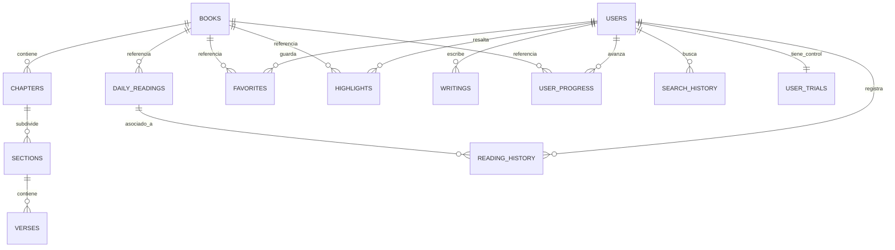

# MODELO Y DICCIONARIO DE DATOS (BBDD)
**Proyecto:** CatholicVerse
**Motor de Base de Datos:** PostgreSQL 16
**Gestión de Esquema:** Flyway (Migraciones V1 - V11)

---

## 1. INTRODUCCIÓN Y ARQUITECTURA
El modelo de datos de CatholicVerse ha sido diseñado separando claramente dos dominios lógicos para maximizar el rendimiento y la seguridad:
1. **Dominio Bíblico (Estático/Inmutable):** Contiene la estructura de la Sagrada Biblia (CPDV) y el calendario litúrgico. Es de "solo lectura" para los usuarios de la aplicación, optimizado para búsquedas rápidas (Full-Text Search).
2. **Dominio de Usuario (Transaccional):** Contiene toda la información dinámica generada por los usuarios (perfiles, favoritos, progreso, notas, suscripciones). Está altamente normalizado y protegido por claves foráneas (Foreign Keys) en cascada para evitar datos huérfanos.

A continuación, se detalla el esquema relacional y el diccionario de datos tabla por tabla.

---

## 2. DIAGRAMA ENTIDAD-RELACIÓN (ER)

---

## 3. DOMINIO BÍBLICO (DICCIONARIO DE DATOS)

### 3.1 Tabla: `books`
Almacena el catálogo de los 73 libros de la Biblia Católica.
- `id` (VARCHAR 50) [PK]: Identificador único (ej. "GEN", "EXO").
- `name` (VARCHAR 100): Nombre completo del libro ("Genesis").
- `abbreviation` (VARCHAR 10): Abreviatura común ("Gn").
- `testament` (VARCHAR 10): "old" (Antiguo Testamento) o "new" (Nuevo Testamento).
- `category` (VARCHAR 50): Pentateuco, Históricos, Proféticos, Evangelios, etc.
- `total_chapters` (INTEGER): Número total de capítulos del libro.
- `order_index` (INTEGER): Orden canónico para listados y navegación.

### 3.2 Tabla: `chapters`
Almacena los capítulos asociados a cada libro.
- `id` (UUID) [PK]: Identificador único generado por base de datos.
- `book_id` (VARCHAR 50) [FK]: Relación al libro padre.
- `chapter_number` (INTEGER): Número del capítulo (1, 2, 3...).
- `version` (VARCHAR 50): Versión del texto (actualmente base CPDV).

### 3.3 Tabla: `sections`
Subdivide los capítulos en perícopas o secciones con título (ej. "La Creación").
- `id` (UUID) [PK]: Identificador único.
- `chapter_id` (UUID) [FK]: Relación al capítulo padre.
- `title` (VARCHAR 255): Título descriptivo de la sección.
- `order_index` (INTEGER): Orden cronológico dentro del capítulo.

### 3.4 Tabla: `verses`
Almacena el texto íntegro y atómico de la Palabra de Dios.
- `id` (UUID) [PK]: Identificador único.
- `section_id` (UUID) [FK]: Relación a la sección padre.
- `verse_number` (INTEGER): Número de versículo exacto.
- `text` (TEXT): Contenido de la sagrada escritura. Tiene un índice `to_tsvector` para búsquedas Full-Text ultrarrápidas.
- `has_note` / `note_text`: Campos opcionales para notas exegéticas o teológicas.

### 3.5 Tabla: `daily_readings`
Calendario litúrgico de lecturas diarias (Misa).
- `id` (UUID) [PK]: Identificador único.
- `date` (DATE) [UNIQUE]: Fecha exacta de la lectura.
- `title` (VARCHAR 255): Título de la festividad o día (ej. "Primer Domingo de Adviento").
- `badge` (VARCHAR 50): Etiqueta visual para la app (ej. "Ordinario", "Cuaresma").
- `reading_text` (TEXT): El fragmento completo de lectura compilado.
- `book_id`, `chapter_number`, `verse_numbers`: Referencias directas para navegación cruzada.

---

## 4. DOMINIO DE USUARIO (DICCIONARIO DE DATOS)

### 4.1 Tabla: `users`
Centro del sistema de autenticación y facturación.
- `id` (UUID) [PK]: Identificador seguro del usuario.
- `email` (VARCHAR 255) [UNIQUE]: Correo electrónico principal.
- `password_hash` (VARCHAR 255): Contraseña cifrada (Bcrypt).
- `provider` (VARCHAR): Origen del registro ("LOCAL", "GOOGLE", "APPLE").
- `is_premium` / `trial_used`: Banderas lógicas sincronizadas con RevenueCat.
- `premium_until`: Fecha de caducidad de suscripción activa.

### 4.2 Tabla: `user_trials`
Sistema antifraude para control de pruebas gratuitas.
- `id` (UUID) [PK], `email` (VARCHAR 255) [UNIQUE].
- Registra permanentemente los emails que ya han consumido los 7 días de prueba, evitando que borren la cuenta para repetirlo.

### 4.3 Tabla: `favorites`
Pasajes que el usuario ha marcado con "Me gusta".
- `user_id` [FK], `book_id` [FK], `chapter_number`, `verse_number`.
- `verse_text`: Se almacena una copia del texto por si la versión de la Biblia cambia.
- `note`: Nota personal breve.

### 4.4 Tabla: `highlights`
Subrayados multicolor en el texto bíblico.
- `user_id` [FK], `book_id` [FK], `chapter_number`, `verse_number`.
- `color` (VARCHAR 20): Código hexadecimal o nombre de color (amarillo, azul, verde).

### 4.5 Tabla: `writings`
Módulo de reflexiones y estudio profundo.
- `id` (UUID) [PK], `user_id` [FK].
- `title` (VARCHAR 255): Título de la reflexión.
- `content` (TEXT): Contenido completo.
- `verse_reference` (JSONB): Permite vincular el escrito a múltiples versículos simultáneamente.

### 4.6 Tablas de Historial y Progreso
- **`reading_history`**: Registra qué días (lectura de `daily_readings`) ha completado el usuario y su reflexión personal del día.
- **`user_progress`**: Registra qué capítulos bíblicos completos ha leído para marcar "checks" en el índice de libros.
- **`search_history`**: Almacena las palabras que busca el usuario (ej. "Amor", "Moisés") para analíticas futuras y autocompletado en el frontend.

---

## 5. HISTÓRICO DE MIGRACIONES ESTRUCTURALES (FLYWAY)

Para entender cómo se construyó este esquema, detallamos el flujo del versionado:
- **V1__initial_schema:** Creación de TODAS las tablas descritas arriba. Relaciones, UUIDs y restricciones en cascada.
- **V4__remove_favorite_unique_constraint:** Ajuste en restricciones para permitir a un usuario tener múltiples favoritos en el mismo capítulo (mejora de UX).
- **V5__create_reading_progress:** Inserción de tabla `user_progress`.
- **V8__add_subscription_fields_to_users:** Modificación de `users` para añadir soporte a RevenueCat (`is_premium`, `trial_used`).
- **V9__create_user_trials_table:** Inserción de la tabla `user_trials` antifraude.
- **V10__add_provider_to_users:** Soporte para inicios de sesión sociales (OAuth2).

*(Las migraciones V2, V3, V6, V7 y V11 fueron scripts inyectores de datos, no estructurales).*
