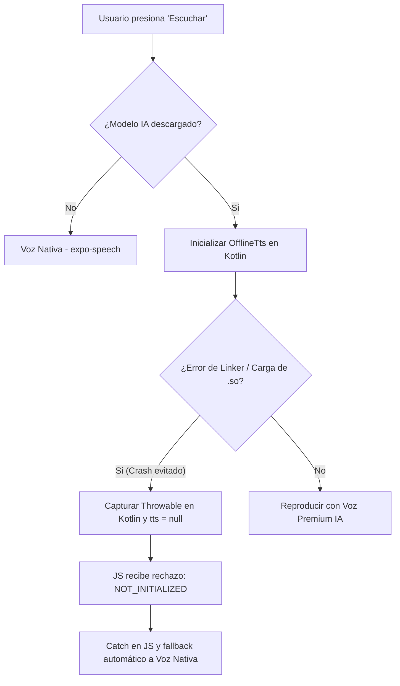

# 🛡️ Estabilización de TTS (OfflineTts) y Pasarela de Suscripciones (RevenueCat)

Este documento detalla la solución a dos crashes críticos de la aplicación móvil (Android/iOS) relacionados con la carga de librerías nativas de TTS y el flujo de compras.

---

## 🎙️ 1. Corrección del Crash de TTS en Android (`UnsatisfiedLinkError`)

### Problema
Al presionar el botón "Escuchar" (Listen) en dispositivos Android (en particular simuladores o dispositivos con arquitecturas más recientes), la aplicación sufría un crash nativo con el siguiente error:
`java.lang.UnsatisfiedLinkError: dlopen failed: empty/missing DT_HASH` en `com.k2fsa.sherpa.onnx.OfflineTts.<clinit>`.
Esto es causado por una compilación incompatible del binario nativo (`.so`) distribuido por la librería `react-native-sherpa-onnx-offline-tts`.

### Solución Implementada
1. **Parche Nativo (Kotlin):** Modificamos `TTSManagerModule.kt` en `node_modules` para envolver la inicialización de `OfflineTts` en un bloque `try-catch` para capturar cualquier `Throwable` (incluidos `LinkageError` y `UnsatisfiedLinkError`). Esto evita que el cargador de clases nativo tumbe el hilo y la aplicación.
2. **Generación del Parche:** Ejecutamos `patch-package` para actualizar y guardar el parche en `/patches/react-native-sherpa-onnx-offline-tts+0.2.6.patch` para que persista automáticamente en futuras instalaciones de dependencias.
3. **Mecanismo de Fallback (JS/TS):** Actualizamos el servicio de audio (`audio.service.ts`) para que si la llamada local por IA falla o el módulo reporta no estar inicializado, la aplicación realice un **fallback automático transparente** a la voz nativa del dispositivo (`expo-speech`), garantizando que el usuario siempre pueda escuchar la Biblia.

### 📊 Flujo de Fallback del Audio

---

## 💳 2. Corrección del Crash en RevenueCat (`TypeError`)

### Problema
Cuando el usuario intentaba realizar una compra desde `PaywallScreen.tsx` seleccionando un plan, la aplicación arrojaba el error:
`Error efectuando compra [TypeError: Cannot read property 'identifier' of undefined]`.
Esto sucedía porque los productos aún no habían cargado de RevenueCat (por red o configuración temporal) quedando `annualPackage` o `monthlyPackage` en `undefined`. Al hacer clic en "Continue with Premium", se pasaba este valor indefinido a la función `purchasePackage(pack)` del SDK, el cual fallaba inmediatamente al intentar acceder a la propiedad `.identifier`.

### Solución Implementada
1. **Validación en la UI (`PaywallScreen.tsx`):** Agregamos una verificación en la función `handlePurchase`. Si el paquete seleccionado está en `undefined`/`null`, se le notifica limpiamente al usuario a través de un Alert nativo que los productos no se han cargado, previniendo el crash de JS.
2. **Salvaguarda en el Contexto (`SubscriptionContext.tsx`):** Protegimos la función `purchasePackage` agregando una validación previa al llamado nativo. Si el argumento `pack` es inválido, retorna `false` y evita llamar al SDK nativo de RevenueCat.
