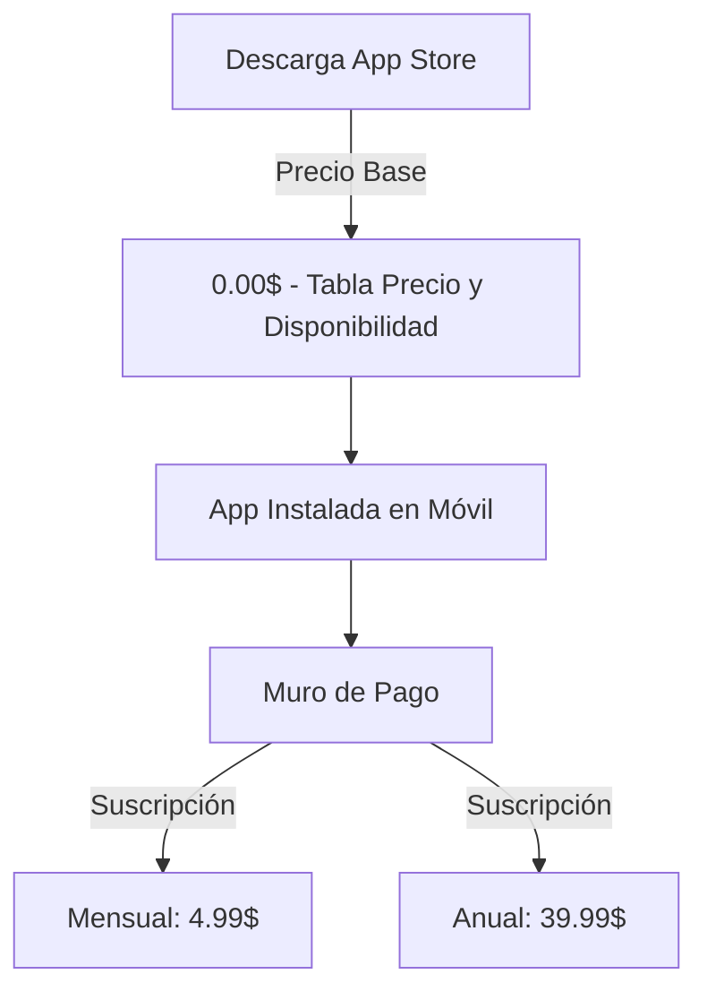

# 🍏 Guía de Configuración: Apple Developer y App Store Connect

Este documento es una guía técnica visual para configurar la "Bóveda" de CatholicVerse dentro del ecosistema de Apple, paso previo indispensable para conectar RevenueCat y recibir pagos.

## FASE 1: Registrar el App ID (Certificates, Identifiers & Profiles)
Si App Store Connect no te permite crear la app porque falta el "Bundle ID", debes registrarlo primero en el portal de desarrolladores.

### Campos a rellenar:
1. **Platform:** `iOS, iPadOS, macOS, tvOS, watchOS, visionOS`.
2. **Description:** Un nombre interno lógico pacífico. Ejemplo: `CatholicVerse App`.
3. **Bundle ID (Explicit):** 🔴 **ESTO ES CRÍTICO.** Tiene que coincidir exactamente letra por letra con nuestro código fuente. Pon: `com.catholicverse.app`
4. **Capabilities (Funcionalidades Especiales):**
   - Haz scroll en la lista larga de la zona inferior.
   - Si crees que en el futuro la gente iniciará sesión con la cara/huella usando Apple, marca la casilla **✅ Sign In with Apple**.
   - Haz clic arriba a la derecha en **"Continue"** y luego en **"Register"** para terminar.

## FASE 2: Crear la App en App Store Connect
Una vez registrado el ID, vuelve a [appstoreconnect.apple.com](https://appstoreconnect.apple.com). 
Haz clic en el gran botón azul **"Añadir app"** y rellena:

- **Plataforma:** iOS
- **Nombre:** CatholicVerse (o CatholicVerse: Bible Study, si alguien ya robó el corto).
- **Idioma principal:** Inglés (EE. UU.) o Español.
- **ID de paquete (Bundle ID):** Ahora sí, despliega el menú y verás tu flamante `com.catholicverse.app`. ¡Escógelo!
- **SKU (Stock Keeping Unit):** Esto es simplemente un "código de barras" inventado por ti para tu propia contabilidad si algún día tienes 50 aplicaciones. No lo ve ningún usuario. Pon simplemente: `CATHOLICVERSE-01`.
- **Acceso de usuarios:** Acceso total.

## FASE 3: Configuración de Precios y Suscripciones (Muro de Pago Público)

La app de **CatholicVerse es GRATIS de descargar**, pero tiene compras "adentro". Debes rellenar dos menús independientes en la barra lateral izquierda:

### 3.1. Precio y disponibilidad (Descarga Base)
**💡 ¿Qué es esto?** Es el precio del "Botón azul de Descargar" en la tienda.
- Si pones $5.00 aquí, la gente tiene que pagar $5.00 para instalar la app en su móvil (antes de ni siquiera abrirla). Minecraft o Procreate usan esto.
- Para CatholicVerse, debe ser **$0.00 (Gratis)**. Queremos que la descarguen sin barreras y luego se topen con el "Muro de Pago" al intentar usar funciones premium.

### 3.2. Compras dentro de la app (In-App Purchases)
**💡 ¿Qué es esto?** Son compras de un solo uso que NO se renuevan.
- Ejemplos: Comprar 100 gemas en un juego, o comprar "Desbloquear el vídeo oculto de San Pedro" por $1.99 una vez en la vida. **No debemos usar esta pestaña para nuestros planes**.

### 3.3. Suscripciones (Donde se cobra de verdad)
**💡 ¿Qué es esto?** Son pagos recurrentes automáticos que Apple cobra a la tarjeta del usuario cada mes o año. Aquí es donde va nuestro modelo de negocio.

1. Ve al menú izquierdo: **Monetización > Suscripciones**.
2. Desplázate hacia abajo hasta **Grupos de suscripción** y dale a "Crear". Ponle de nombre: `CatholicVerse Premium`.
3. Dentro de ese grupo, añade las suscripciones reales (`Crear Suscripción`):
   - **Mensual:**
     - Nombre de referencia: `catholicverse_premium_monthly`
     - ID de producto: `catholicverse_premium_monthly`
     - Precio: **$4.99 USD** (Deja que Apple calcule las conversiones automáticas internacionales).
   - **Anual:**
     - Nombre de referencia: `catholicverse_premium_yearly`
     - ID de producto: `catholicverse_premium_yearly`
     - Precio: **$39.99 USD** (Con conversiones automáticas).

### 3.4. Información para la revisión (El Mapa para Apple)
Apple tiene revisores humanos (*testers*) en California que van a probar tu app manualmente. Nunca te aprueban una compra si no les mandas un "mapa" de cómo la vendes.
1.  **Captura de pantalla:** Sube una foto pura de la app mostrando el Muro de Pago. 
    - 🔴 **Error común de tamaño:** Apple rechazará la imagen si haces una captura normal en Mac (Cmd+Shift+4) porque coge los bordes negros del teléfono y el tamaño se rompe. 
    - ✅ **Solución:** Abre el Simulador de iOS, entra en la pantalla del Paywall y presiona **`CMD + S`**. Esto guardará una captura "mágica" con la resolución milimétrica y oficial de un iPhone en el Escritorio de tu Mac. Sube esa.
2.  **Notas de revisión (Review Notes):** Escribe un mensaje directo para el revisor humano en inglés:
   > *"This subscription unlocks all the restricted content in the app. Users can access the paywall directly from the main view when trying to open a locked feature."*

### 4.1. ¿Dónde está el **App‑Specific Shared Secret**?
1. En el **panel izquierdo** de App Store Connect, elige tu aplicación (la que acabas de crear). 
2. Haz clic en **"App Information"** (puede aparecer como **Información de la app** en español). 
3. Desplázate hacia abajo hasta la sección **"General"**; allí verás un recuadro titulado **"App‑Specific Shared Secret"**.
   - Si nunca lo has generado, el recuadro mostrará un botón **"Generate"** (Generar). 
   - Si ya lo tienes, aparecerá el código hexadecimal y un botón **"Regenerate"** (Regenerar) al lado.
4. Pulsa **Generate** y copia el código que aparece. Es una cadena larga como `a1b2c3d4e5f6...`.
5. **Importante:** Guárdalo en un gestor de contraseñas seguro; lo necesitarás en RevenueCat y nunca lo compartas públicamente.

Una vez copiado, sigue los pasos de la **FASE 4** para pegarlo en RevenueCat.

## FASE 5: Burocracia Apple (Contratos, StoreKit e Impuestos)
Si es tu primera vez vendiendo en Apple, o si te rechazan las credenciales en RevenueCat, necesitas habilitar los permisos financieros de tu cuenta en la web de desarrollador:

### 5.1. Acuerdos y Contacto Financiero (Agreements, Tax, and Banking)
1. Ve al panel principal de [App Store Connect](https://appstoreconnect.apple.com/).
2. Haz clic en el módulo de **Agreements, Tax, and Banking** (Acuerdos, impuestos y operaciones bancarias).
3. Tienes que aceptar el contrato de "Aplicaciones de Pago" (Paid Apps). Te pedirá tus datos corporativos/personales, **una tarjeta de crédito o cuenta bancaria válida** donde Apple te va a pagar, y rellenar un par de formularios fiscales para demostrar que no vives en Marte.
4. **App Store Small Business Program:** 
   - Apple cobra un "robo" del 30% de comisión por cada suscripción. ¡PERO! Si pides entrar a este programa (y ganas menos de 1 Millón al año), te lo bajan al **15%**. Busca el formulario en la web de desarrollador e inscríbete para ahorrarte miles de dólares.

### 5.2. StoreKit 2 (Dando permisos máximos)
A veces el *Shared Secret* básico restringe las cosas nuevas. RevenueCat recomienda crear una "In-App Purchase Key" (Llave de StoreKit 2):
1. Ve a **Usuarios y acceso** (Users and Access) en App Store Connect.
2. Clic en **Integracions** (Integrations) > **In-App Purchase**.
3. Dale al `+` para crear una llave. Llámala `RevenueCat Key`.
4. Descarga la llave (un archivito `.p8`), copia el *Issuer ID* y el *Key ID*.
5. Mételos todos en el panel de RevenueCat (Project Settings > Apple App Store) para una conexión financiera de máxima fidelidad y cero latencia.
