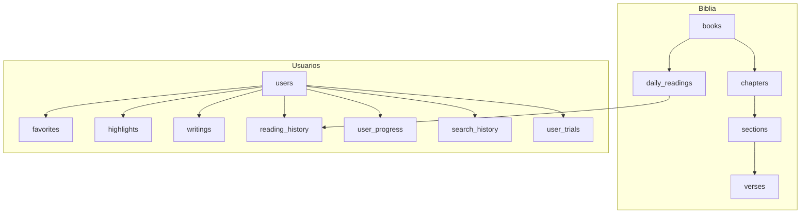
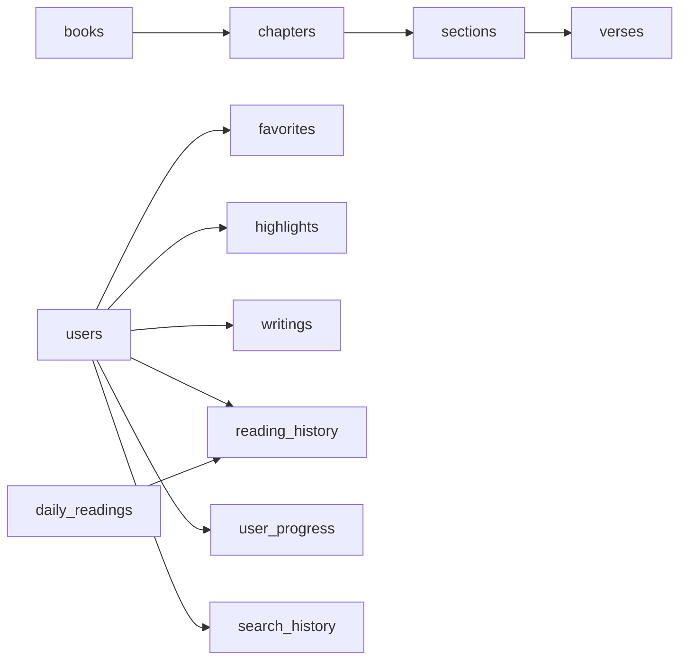

# 3. DESARROLLO DEL PROYECTO

## 3.1 ANALISIS

### Objetivo general
CatholicVerse ofrece una experiencia integral de lectura bíblica, estudio personal y productividad espiritual, con sincronizacion segura, modo offline, y acceso premium mediante suscripcion.

### Principales casos de uso
1. Registro e inicio de sesion (email o social).
2. Recuperacion de contrasena por email (Resend).
3. Navegar libros, capitulos y versiculos (incluyendo base actual CPDV en ingles).
4. Buscar pasajes por texto o por voz (soporte de microfono en UI).
5. Consultar lectura diaria y calendario liturgico.
6. Guardar y consultar favoritos y resaltados.
7. Crear y editar escritos/reflexiones personales.
8. Personalizacion de lectura (ajustes de tamano de fuente y temas de color).
9. Reproduccion de audio de pasajes mediante TTS (Nativo e IA local con Sherpa-ONNX).
10. Gestion de acceso premium (trial de 7 dias y paywall mediante RevenueCat).
11. Uso de asistente de IA para apoyo al estudio para enriquecer la experiencia.
12. Uso offline con descargas y cache local.

### Diagrama de casos de uso (alto nivel)
```mermaid
flowchart LR
  Usuario((Usuario)) --> Auth[Registro / Login]
  Usuario --> Read[Leer Biblia]
  Usuario --> Search[Buscar Versiculos]
  Usuario --> Daily[Lectura Diaria]
  Usuario --> Fav[Gestionar Favoritos]
  Usuario --> Notes[Escritos y Notas]
  Usuario --> AI[Asistente IA]
  Usuario --> Offline[Modo Offline]
  Usuario --> Premium[Suscripcion / Paywall]
  Auth --> Email[Recuperar Contrasena (Resend)]
```

### Tablas y como se crean/modifican por migraciones
- **V1 (crea tablas base):** users, books, chapters, sections, verses, favorites, highlights, writings, daily_readings, reading_history, user_progress, search_history.
- **V4 (modifica):** favorites (ajuste de restriccion/constraint).
- **V5 (crea):** user_progress (progreso de lectura).
- **V8 (modifica):** users (campos de suscripcion/trial).
- **V9 (crea):** user_trials (persistencia de trial).
- **V10 (modifica):** users (campo provider).
- **V2/V3/V6/V7/V11 (datos):** no crean tablas, insertan o actualizan datos.

### Resumen simple de migraciones (V1–V11)
- V1: crea TODA la estructura base (tablas y campos principales).
- V2: mete la lista de libros (solo nombres/metadata, no versiculos).
- V3: mete lecturas diarias basicas de prueba (historico).
- V4: arregla la restriccion de favoritos para que no falle o duplique mal.
- V5: añade progreso de lectura (guardar capitulos leidos).
- V6: cambia los nombres/metadatos de libros a ingles (porque la base CPDV esta en ingles).
- V7: ajusta la version del capitulo y los badges de lecturas diarias para que la UI quede correcta.
- V8: añade campos de suscripcion/trial en users (premium).
- V9: crea user_trials para evitar que el trial se reinicie por email.
- V10: añade provider para distinguir LOCAL/GOOGLE/APPLE.
- V11: mete las 365 lecturas diarias completas (la definitiva).

**Migraciones consideradas:**
- **Esquema:** V1, V4, V5, V8, V9, V10.
- **Datos/seed:** V2, V3, V6 (tabla books), V7 (chapters y daily_readings), V11.

### Diagrama ER (estructura completa de tablas)


### Esquema simplificado de tablas (lectura rapida)


## 3.2 DISENO

### Diseno del modelo de datos
- Base relacional en PostgreSQL con migraciones Flyway.
- Separacion clara de entidades biblicas (books, chapters, sections, verses) y entidades de usuario (favorites, writings, highlights, progreso, historial).
- Campos de suscripcion y trial en `users` + tabla `user_trials` para persistencia antifraude.
- Campo `provider` en `users` para distinguir autenticacion LOCAL, GOOGLE o APPLE.
- Seed de lecturas diarias para 365 dias (V11).

### Diseño de interfaces de usuario
El diseño de interfaces en CatholicVerse sigue una filosofía de **estética litúrgica y sobria**, orientada a facilitar la meditación y lectura prolongada sin fatiga visual. A continuación se detallan las pantallas clave de la aplicación, analizando su paleta de colores, componentes de UI, comportamiento UX y su relación con los casos de uso.

#### 1. Pantalla de Inicio de Sesión (Sign In / Autenticación)
*   **Imagen Referencial**: ``
*   **Identidad Visual y Diseño (Colores y Estilo)**: 
    *   **Fondo de Pantalla**: Color marfil sutil (`colors.ivory.DEFAULT`, `#FAF9F6`) con una textura suave de papel que transmite calma.
    *   **Estilo del Logotipo**: En la parte superior central, se presenta una cruz latina dorada superpuesta sobre una Biblia abierta (`colors.gold.DEFAULT`, `#D4AF37`), aportando una identidad espiritual e institucional clara.
    *   **Modo Oscuro**: Selector rápido en la parte superior derecha representado por una luna creciente en color carbón oscuro (`colors.charcoal.dark`, `#1F2937`).
*   **Elementos de Interfaz (UI)**:
    *   **Campos de Texto (Inputs)**: Diseño redondeado con fondo gris/crema suave (`colors.ivory.shade`, `#F2EFE9`). Incorporan iconos representativos a la izquierda (sobre para *Email*, candado para *Password*) en tono dorado tenue (`colors.gold.dim`, `#B09050`). El campo de contraseña incluye a la derecha el icono para revelar/ocultar texto.
    *   **Enlace "Forgot Password?"**: Situado debajo del campo de contraseña, alineado a la derecha, en cursiva y con el color acento borgoña (`colors.burgundy.DEFAULT`, `#903040`).
    *   **Botón Principal (Sign In)**: Botón rectangular con bordes redondeados y fondo verde salvia (`colors.primary.DEFAULT`, `#6B9080`), con texto en blanco de gran legibilidad.
    *   **Sección de Autenticación Social**: Separador visual centrado ("Or continue with") en tipografía de bajo contraste, seguido por el botón "Continue with Google" en fondo blanco con borde sutil.
    *   **Pie de página**: Enlace para redirigir al registro ("Don't have an account? Sign Up"), con la acción "Sign Up" destacada en rojo borgoña.
*   **Experiencia de Usuario (UX) e Interacción**:
    *   Micro-animación en botones principales al presionar (reducción de escala suave o cambio de opacidad al 80%).
    *   Transiciones suaves de entrada en los campos y validación en tiempo real para correos electrónicos mal formateados.

#### 2. Pantalla de Registro (Create Account / Registro de Usuarios)
*   **Imagen Referencial**: ``
*   **Identidad Visual y Diseño (Colores y Estilo)**:
    *   Mantiene la consistencia del fondo marfil (`colors.ivory.DEFAULT`).
    *   El logotipo se desplaza de manera armoniosa a la esquina superior izquierda en tamaño reducido, dando espacio al encabezado principal "Create Account" en tipografía Sans-Serif negrita en color carbón oscuro (`colors.charcoal.dark`, `#1F2937`).
*   **Elementos de Interfaz (UI)**:
    *   **Campos de Texto Adicionales**: Además de *Email* y *Password*, incluye el campo *Full Name* (icono de persona) y la confirmación de contraseña *Password* (icono de candado con flecha circular de reseteo).
    *   **Checkbox de Términos**: Casilla de selección redondeada y sutil acompañada del texto legal "Accept Terms and Privacy Policy", con enlaces activos en color borgoña.
    *   **Botón Principal**: Botón "Create Account" en verde salvia (`colors.primary.DEFAULT`, `#6B9080`).
*   **Experiencia de Usuario (UX) e Interacción**:
    *   Boton de retorno (flecha izquierda) en la cabecera superior izquierda que permite volver a la pantalla de login con una transición lateral.
    *   Bloqueo de botón "Create Account" en estado deshabilitado (opacidad reducida) hasta que se marquen los términos y condiciones y las contraseñas coincidan.

#### 3. Pantalla de Bienvenida y Activación de Trial (Trial Popup / Modal)
*   **Imagen Referencial**: ``
*   **Identidad Visual y Diseño (Colores y Estilo)**:
    *   **Fondo**: Superposición translúcida oscura (`colors.charcoal.dark` con 80% de opacidad) que aísla visualmente la ventana modal y centra la atención del usuario.
    *   **Modal**: Tarjeta flotante con esquinas muy redondeadas y fondo crema puro (`colors.cream`, `#FAFAF5`).
*   **Elementos de Interfaz (UI)**:
    *   **Logotipo Circular**: Cabecera circular con la cruz en dorado sobre fondo beige.
    *   **Mensaje de Bienvenida**: Título "Welcome to CatholicVerse" en azul carbón, seguido de un texto explicativo donde se resalta en tono dorado la frase **"7 days of Premium access"**, creando un estímulo visual positivo inmediato.
    *   **Botón Principal (Start Exploring)**: Verde salvia con bordes redondeados.
    *   **Botón Secundario**: Enlace estilizado inferior "View Premium Plans" en color ocre/dorado.
*   **Experiencia de Usuario (UX) e Interacción**:
    *   Aparición suave con efecto *fade-in* y una ligera escala desde el centro.
    *   Acceso inmediato y transparente al período de prueba premium al presionar "Start Exploring", almacenando localmente el estado en base de datos (`user_trials`) para evitar abusos o reseteos fraudulentos.

#### 4. Pantalla de Lectura Diaria (Home / "Daily Bread")
*   **Imagen Referencial**: ``
*   **Identidad Visual y Diseño (Colores y Estilo)**:
    *   **Cabecera Superior**: Texto litúrgico en la parte superior en rojo borgoña ("TODAY'S READING") con la fecha actual del día en color carbón destacado.
    *   **Ilustración Hero**: Hermosa composición minimalista en formato panorámico que simula un paisaje montañoso espiritual y nubes con gradientes sutiles de verde salvia, turquesa pastel y crema.
    *   **Texto Bíblico**: Tipografía Serif (de tipo literario) de alta legibilidad, en color carbón oscuro. Destaca una **letra capitular (Drop Cap)** en la primera letra del versículo en color ocre/dorado (`colors.gold.accent`, `#D4A373`).
*   **Elementos de Interfaz (UI)**:
    *   **Controles de Cabecera**: Acceso directo al bottom sheet de ajustes de fuente ("Tt") y al selector de calendario litúrgico en la esquina superior derecha.
    *   **Badge de Categoría**: Etiqueta destacada "DAILY BREAD" con fondo borgoña (`colors.burgundy.accent`, `#9D5C63`) y bordes redondeados.
    *   **Cita Bíblica**: Texto del pasaje (ej. "Philemon 1:14") en verde salvia oscuro.
    *   **Barra de Acciones Rápidas**: Botones de "LISTEN" (reproductor de audio con motor TTS nativo u offline Sherpa-ONNX) con icono turquesa, "SHARE" para compartir pasajes, y el botón de verificación para marcar el progreso de lectura diario (`user_progress`).
    *   **Sección de Reflexión Personal (Personal Reflection)**: Caja de texto integrada en la base con bordes redondeados, etiqueta indicadora "PRIVATE", campos para el título y descripción de la reflexión, y un botón de acción flotante (FAB) en color verde salvia con icono de pluma.
    *   **Barra de Navegación Inferior (Bottom Tab Bar)**: Fondo en color crema con iconos limpios y discretos. La pestaña activa ("Home") se resalta en verde salvia.
*   **Experiencia de Usuario (UX) e Interacción**:
    *   Desplazamiento vertical suave y fluido.
    *   El botón flotante (FAB) de reflexión personal utiliza una física interactiva inteligente (se esconde o minimiza al hacer scroll rápido hacia abajo para liberar espacio de lectura, y reaparece al hacer scroll hacia arriba).
    *   El reproductor de audio ("LISTEN") levanta un minireproductor global persistente (`AudioPlayerOverlay`).

#### 5. Ajustes de Lectura (Font Customization Bottom Sheet)
*   **Imagen Referencial**: ``
*   **Identidad Visual y Diseño (Colores y Estilo)**:
    *   Panel deslizable (*Bottom Sheet*) que emerge desde el borde inferior de la pantalla con bordes superiores muy redondeados, manteniendo el fondo crema y textura suave de la aplicación.
*   **Elementos de Interfaz (UI)**:
    *   **Selector de Estilo de Fuente (Segmented Control)**: Control con fondo de color marfil sombreado (`colors.ivory.shade`) y un botón activo en blanco puro con relieve suave que permite alternar entre tipografía **Serif** (para una lectura clásica y bíblica) y **Sans** (para una lectura más moderna y directa).
    *   **Control del Tamaño de Fuente (Slider)**:
        *   Indicador de porcentaje actual (ej: "110%") en un badge verde claro a la derecha.
        *   Barra de deslizamiento con un thumb circular verde salvia (`colors.primary.DEFAULT`). Iconos representativos de tipografía ("Tt") en los extremos izquierdo (pequeño) y derecho (grande) para guiar la interacción de manera intuitiva.
*   **Experiencia de Usuario (UX) e Interacción**:
    *   Efecto de amortiguación visual y cierre rápido al deslizar el panel hacia abajo (*gestures* habilitados).
    *   Cambios tipográficos y de tamaño aplicados instantáneamente a la pantalla de lectura en segundo plano en tiempo real sin necesidad de guardar o recargar la vista.

#### 6. Calendario Litúrgico de Lecturas (Reading Calendar)
*   **Imagen Referencial**: ``
*   **Identidad Visual y Diseño (Colores y Estilo)**:
    *   **Fondo de Pantalla**: Color marfil limpio (`colors.ivory.DEFAULT`).
    *   **Tipografía y Acentos**: Cabecera limpia en azul marino, indicador mensual destacado en un elegante color rojo borgoña litúrgico (`colors.burgundy.DEFAULT`, `#903040`) (ej. "May 2026"), y días seleccionados en un círculo perfecto de color verde salvia (`colors.primary.DEFAULT`, `#6B9080`) con el número en blanco.
*   **Elementos de Interfaz (UI)**:
    *   **Navegación del Calendario**: Flechas sutiles a la derecha del mes para navegar entre períodos. Días de la semana en abreviaturas de tres letras y bajo contraste.
    *   **Tarjeta de Estado de Lectura**: Tarjeta flotante en la mitad inferior con fondo crema (`colors.cream`, `#FAFAF5`) y bordes redondeados. Muestra el estado actual ("PENDING" o "COMPLETED") junto a un icono de marcador (bookmark), la fecha corta, el título del pasaje en azul carbón negrita y un fragmento del versículo del día en tipografía Serif itálica.
    *   **Botón de Acción (READ ->)**: Botón verde salvia en la esquina inferior derecha con una flecha que invita a la lectura inmediata del pasaje seleccionado.
*   **Experiencia de Usuario (UX) e Interacción**:
    *   Actualización reactiva asíncrona e instantánea de la tarjeta de lectura inferior al presionar cualquier día del mes.
    *   Transición fluida mediante deslizamiento horizontal (*swipe gestures*) para cambiar entre meses del calendario.

#### 7. Hub de Biblia y Búsqueda (Search Screen / Bible Hub)
*   **Imagen Referencial**: ``
*   **Identidad Visual y Diseño (Colores y Estilo)**:
    *   Título de cabecera principal "Search" en negrita grande y azul carbón oscuro, acompañado del selector rápido de modo oscuro (luna) y el acceso al perfil.
*   **Elementos de Interfaz (UI)**:
    *   **Barra de Búsqueda**: Campo de texto ovalado con fondo grisáceo suave (`colors.ivory.shade`), lupa decorativa a la izquierda y un icono de micrófono en verde a la derecha habilitado para la **búsqueda por voz / dictado por micrófono**.
    *   **Tarjetas de Navegación por Testamentos**: Tres grandes banners redondeados con imágenes fotográficas de Biblias difuminadas en el fondo bajo filtros de color semánticos:
        1. *Old Testament* (Antiguo Testamento): Filtro azul verdoso con badge de conteo de libros ("46 BOOKS") en verde claro y botón translúcido de acceso.
        2. *New Testament* (Nuevo Testamento): Filtro de tonalidad borgoña/rosa con badge de conteo ("27 BOOKS") y botón de acceso.
        3. *Continue reading* (Continuar lectura): Filtro azul clásico con indicador de la última lectura activa (ej. "JOSHUA 1") y botón circular con icono de "Play".
    *   **Botón Flotante de IA (FAB)**: Botón circular en la esquina inferior derecha en color turquesa/salvia oscuro con destellos de estrellas en blanco, sirviendo de acceso directo para el **Asistente de IA**.
*   **Experiencia de Usuario (UX) e Interacción**:
    *   Feedback táctil con micro-escala y relieve sombadge en las tarjetas de testamentos al presionar.
    *   Entrada de texto dinámica que muestra búsquedas recientes y sugerencias a medida que el usuario escribe.

#### 8. Asistente de Estudio de IA (AI Assistant)
*   **Imagen Referencial**: ``
*   **Identidad Visual y Diseño (Colores y Estilo)**:
    *   Interfaz con fondo de alto contraste crema y una estructura limpia tipo mensajería instantánea.
*   **Elementos de Interfaz (UI)**:
    *   **Burbujas de Diálogo**: Los mensajes enviados por el asistente virtual se organizan en globos con fondo marfil sombreado (`colors.ivory.shade`), esquinas redondeadas y tipografía Sans-Serif carbón de lectura ágil.
    *   **Área de Entrada**: Caja de texto redondeada inferior en color crema claro con placeholder explicativo y un botón de enviar circular en color azul grisáceo con el icono clásico del avión de papel.
*   **Experiencia de Usuario (UX) e Interacción**:
    *   Simulación conversacional en tiempo real con animaciones de carga ("escribiendo...") mediante tres puntos oscilantes.
    *   Scroll inteligente automático hacia el último mensaje recibido para mantener la conversación siempre visible.

#### 9. Navegador de Libros (Books Screen - Old/New Testament)
*   **Imagen Referencial**: ``
*   **Identidad Visual y Diseño (Colores y Estilo)**:
    *   Mantiene los fondos marfil de lectura limpia. La cabecera incluye el título del testamento activo ("Old Testament") y un input de búsqueda contextual para filtrar libros específicos.
*   **Elementos de Interfaz (UI)**:
    *   **Filtros de Categoría (Chips)**: Barra horizontal de categorías (ej. *All*, *Pentateuch*, *Historical Books*, *Writings*) con bordes muy redondeados. El filtro activo adopta un color de fondo verde salvia sólido con texto en blanco, mientras que los inactivos muestran bordes sutiles.
    *   **Separadores Litúrgicos**: Etiquetas de grupo en color rojo teja y mayúsculas, acompañadas de un filete vertical rojo que segmenta con rigor los grupos de libros (ej. `| PENTATEUCH`).
    *   **Tarjetas de Libros**: Listado de tarjetas blancas redondeadas con un avatar circular a la izquierda que contiene la abreviatura del libro en tres letras (ej: `GEN`, `EX`, `JOS`) con códigos de color específicos, el título del libro, metadatos del total de capítulos e iconos de navegación derecha.
*   **Experiencia de Usuario (UX) e Interacción**:
    *   Desplazamiento vertical optimizado de alta velocidad (FlatList reactiva).
    *   Filtrado instantáneo en menos de 100ms de los libros al pulsar sobre los chips de categorías litúrgicas o al teclear en el buscador superior.

#### 10. Detalle de Libro y Selector de Capítulos (Chapter Selector)
*   **Imagen Referencial**: ``
*   **Identidad Visual y Diseño (Colores y Estilo)**:
    *   Cabecera superior que indica el libro activo en azul marino y el testamento en formato pequeño grisáceo.
*   **Elementos de Interfaz (UI)**:
    *   **Banner Informativo (Hero Card)**: Tarjeta superior destacada con fondo gris marfil, que incluye un badge litúrgico rectangular redondeado (ej. "PENTATEUCO"), el título del libro ("Genesis"), una descripción teológica y argumental en Serif y una marca de agua a la derecha con un icono estilizado de un libro abierto.
    *   **Cuadrícula de Capítulos (Grid)**: Sección con el contador total ("50 Chapters") y una rejilla regular de 5 columnas que contiene botones cuadrados de esquinas redondeadas en color marfil y texto en azul marino oscuro negrita.
*   **Experiencia de Usuario (UX) e Interacción**:
    *   Acceso instantáneo a cualquier capítulo con una sola pulsación.
    *   Efecto de escala y cambio de color del botón numérico al mantener pulsado antes de realizar la navegación.

#### 11. Pantalla de Lectura de Versículos (Bible Chapter Reading)
*   **Imagen Referencial**: ``
*   **Identidad Visual y Diseño (Colores y Estilo)**:
    *   **Fondo de Pantalla**: Color marfil limpio (`colors.ivory.DEFAULT`) que evita el cansancio ocular.
    *   **Tipografía y Lectura**: Tipografía Serif (de corte clásico litúrgico) para el cuerpo del texto bíblico en color azul marino casi negro, con números de versículo en formato superíndice discreto en color carbón.
    *   **Paleta de Resaltados (Highlights)**: Soporte visual para el pintado del fondo de versículos en colores pastel litúrgicos sincronizados localmente:
        *   *Resaltado Verde*: Tono verde menta suave (`#B0F2C2`) para ideas espirituales de esperanza y crecimiento.
        *   *Resaltado Rosa*: Tono rosa pastel suave (`#FBC4D8`) para versículos asociados al amor y la misericordia.
*   **Elementos de Interfaz (UI)**:
    *   **Cabecera**: Flecha de volver a la izquierda, título centrado del libro y capítulo en negrita (ej. "Genesis 1"), icono de ajustes tipográficos ("Tt") y el menú de acciones del capítulo (tres puntos verticales) en el extremo derecho.
*   **Experiencia de Usuario (UX) e Interacción**:
    *   Scroll vertical fluido y de gran respuesta táctil.
    *   Menú contextual que se desata de manera instantánea mediante una pulsación larga sobre cualquier versículo individual, sombreándolo sutilmente para indicar selección.

#### 12. Barra de Herramientas de Selección y Resaltado (Verses Context Toolbar)
*   **Imagen Referencial**: ``
*   **Identidad Visual y Diseño (Colores y Estilo)**:
    *   Barra de herramientas flotante superior (*Overlay*) de color negro carbón profundo (`colors.charcoal.dark`, `#1F2937`) con bordes sumamente redondeados, creando una separación visual limpia y premium sobre el texto sagrado.
*   **Elementos de Interfaz (UI)**:
    *   **Indicador de Selección**: Texto con la abreviatura y número del versículo interactivo a la izquierda (ej. "v.3").
    *   **Paleta de Colores de Resaltado**: Cuatro botones circulares en tonos pastel interactivos (Amarillo, Verde menta, Azul y Rosa pastel).
    *   **Acciones Rápidas**: Botón de ocultar/limpiar resaltado (ojo tachado), botón de favoritos (corazón), botón de compartir (share) y botón de cierre ("x") para liberar la selección. Todos los iconos se muestran en color blanco/gris de alta legibilidad.
*   **Experiencia de Usuario (UX) e Interacción**:
    *   Animación fluida de entrada lateral/despliegue en la parte superior al activar la selección táctil de un versículo.
    *   Aplicación en caliente e instantánea de los resaltados de color con transiciones suaves de opacidad al pulsar sobre la paleta de colores flotante.

#### 13. Menú de Opciones del Capítulo (Chapter Options Popover)
*   **Imagen Referencial**: ``
*   **Identidad Visual y Diseño (Colores y Estilo)**:
    *   Diálogo modal flotante en la esquina superior derecha con fondo crema (`colors.cream`) y bordes muy redondeados. Posee una sombra sutil perimetral que aporta profundidad y un acabado de alta gama.
*   **Elementos de Interfaz (UI)**:
    *   Tres opciones verticales limpias con iconos representativos circulares en color ocre/dorado (`colors.gold.DEFAULT`):
        1. *Save full chapter* (icono de marcador): Descarga y persiste el capítulo íntegro en la base de datos local para acceso offline.
        2. *Share chapter* (icono de compartir): Abre el diálogo nativo de compartir para transferir el texto completo.
        3. *Listen audio* (icono de auriculares): Activa la lectura de voz del capítulo (TTS), levantando el minireproductor global persistente.
*   **Experiencia de Usuario (UX) e Interacción**:
    *   Animación elegante de escalado desde el punto de anclaje (cabecera). Un leve oscurecimiento táctil fuera del menú permite cerrarlo con facilidad.

#### 14. Pantalla de Favoritos y Resaltados (Favorites Screen)
*   **Imagen Referencial**: ``
*   **Identidad Visual y Diseño (Colores y Estilo)**:
    *   Fondo marfil e interfaz minimalista muy espaciada que destaca el texto bíblico preferido del usuario.
*   **Elementos de Interfaz (UI)**:
    *   **Buscador e Indicadores**: Input de búsqueda redondeado y chips de filtrado contextual rápido (`All`, `Old Testament`, `New Testament`).
    *   **Tarjetas de Favoritos**: Tarjetas en fondo blanco puro con esquinas redondeadas. Cada una incorpora la referencia y la fecha en que se marcó en color rojo borgoña (ej. "Genesis 1 • May 18"), el versículo preferido en tipografía Serif y un **detalle premium**: una fina línea vertical en verde salvia (`colors.primary.DEFAULT`) en el margen izquierdo del versículo que actúa como resalte e identidad de marca.
*   **Experiencia de Usuario (UX) e Interacción**:
    *   Filtrado dinámico inmediato del listado al pulsar sobre los chips de categorías.
    *   Pulsación directa sobre la tarjeta que ejecuta una redirección rápida a la pantalla de lectura con el versículo enfocado en su contexto completo del capítulo.

#### 15. Pantalla de Escritos Personales (Personal Writings Screen)
*   **Imagen Referencial**: ``
*   **Identidad Visual y Diseño (Colores y Estilo)**:
    *   Consistencia cromática absoluta con la pantalla de favoritos, favoreciendo una experiencia de usuario integrada.
*   **Elementos de Interfaz (UI)**:
    *   **Buscador y Chips**: Barra de búsqueda redondeada para escritos y chips horizontales de categorización.
    *   **Tarjetas de Escritos**: Tarjetas blancas con esquinas redondeadas que integran:
        *   Cita bíblica asociada arriba a la izquierda en rojo borgoña litúrgico (ej. "Philemon 1:14").
        *   Badge crema indicando la fecha de la última edición a la derecha (ej. "23 may").
        *   Título de la reflexión en negrita carbón ("prueba1") y el contenido del escrito en tipografía Sans-Serif cómoda de color carbón.
        *   **Línea vertical verde salvia** en el margen izquierdo que da un gran balance de diseño y consistencia visual con el resto de la app.
*   **Experiencia de Usuario (UX) e Interacción**:
    *   Transición fluida lateral hacia la pantalla de detalle de reflexión al pulsar sobre cualquier tarjeta de escrito.
    *   Filtrado inteligente en tiempo real que busca términos tanto en los títulos como en el contenido de las reflexiones.

#### 16. Pantalla de Detalle de Escrito (Writing Detail Screen)
*   **Imagen Referencial**: ``
*   **Identidad Visual y Diseño (Colores y Estilo)**:
    *   **Fondo de Pantalla**: Color marfil limpio (`colors.ivory.DEFAULT`).
    *   **Tipografía y Acentos**: Título principal del escrito en azul marino muy oscuro y negrita de gran escala (`colors.charcoal.dark`), cuerpo de la nota en Serif carbón y badge de fecha con icono de calendario verde en la parte superior izquierda en crema suave.
*   **Elementos de Interfaz (UI)**:
    *   **Cabecera**: Flecha de retorno, título "Writing Detail", icono "Tt" de ajustes y botón de compartir.
    *   **Tarjeta de Versículo Asociado (Associated Verse)**: Tarjeta flotante crema con un **borde izquierdo grueso en ocre dorado** (`colors.gold.DEFAULT`, `#D4AF37`) que le otorga un gran contraste de atención visual. Integra un icono de libro abierto en borgoña litúrgico, la referencia bíblica ("Philemon 1:14") y el texto exacto en Serif itálico. En la base cuenta con el botón interactivo "Read Full Chapter ->" en verde salvia.
    *   **Botones de Acción inferiores**: Fila de control que incluye el botón de eliminar (**Delete**) en color blanco con contorno borgoña e icono de papelera, y el botón de editar (**Edit Writing**) en color verde salvia sólido con icono de pluma estilográfica.
*   **Experiencia de Usuario (UX) e Interacción**:
    *   Al pulsar "Delete", se desata un diálogo de confirmación emergente nativo para evitar la pérdida accidental de datos.
    *   Transición lateral fluida con efecto *slide-in* desde la derecha al pulsar "Edit Writing" para acceder a la pantalla de edición.

#### 17. Pantalla de Edición de Escrito (Editing Writing Screen)
*   **Imagen Referencial**: ``
*   **Identidad Visual y Diseño (Colores y Estilo)**:
    *   Entorno de edición con fondo marfil y una distribución sumamente clara que facilita la redacción espiritual.
*   **Elementos de Interfaz (UI)**:
    *   **Controles de Edición**: Cabecera "Editing Writing" e indicador textual superior derecho en color ocre dorado y cursiva que reza `Edit Mode`.
    *   **Campos de Texto**: Inputs editables para el título (`prueba1`) y el cuerpo del escrito (`prueba`).
    *   **Tarjeta del Versículo**: Ficha inferior del versículo asociado (`REFERENCE (not editable)`) atenuada con un overlay de opacidad reducida para indicar su estado de solo lectura.
    *   **Botones inferiores**: Fila horizontal con el botón **Cancel** (blanco con borde borgoña e icono "X") y el botón **Save** (verde salvia sólido con icono de disquete).
*   **Experiencia de Usuario (UX) e Interacción**:
    *   Ajuste automático de la vista (*keyboard-avoiding view*) para evitar que el teclado nativo del terminal solape los campos interactivos de texto.
    *   Lógica asíncrona que actualiza el registro en el backend (`writings`) y refresca la vista de detalle con los nuevos datos al presionar "Save".

#### 18. Pantalla de Perfil de Usuario (User Profile / My Profile Screen)
*   **Imagen Referencial**: ``
*   **Identidad Visual y Diseño (Colores y Estilo)**:
    *   Fondo marfil claro y organización modular estructurada en tarjetas redondeadas individuales.
*   **Elementos de Interfaz (UI)**:
    *   **Banner de Actualización Premium (Upgrade Banner)**: Situado en el extremo superior, un banner rectangular crema con contorno dorado completo. Integra un icono de medalla de cinta dorada, el texto "Upgrade to Premium" y una flecha indicadora dorada.
    *   **Ficha Central**: Avatar circular grande en color verde salvia con la inicial ("P") en blanco en el centro, botón flotante circular de lápiz para editar la foto de perfil, nombre de usuario y correo electrónico en color carbón.
    *   **Menú de Opciones Modular**: Tarjetas individuales con fondo blanco puro y esquinas redondeadas, incluyendo un icono de fondo beige, título, subtítulo explicativo y flecha derecha en gris:
        *   *Reading Settings* (icono de libro): Ajustes tipográficos.
        *   *My Account* (icono de persona): Datos personales y perfil.
        *   *Guide & Support* (icono de pregunta): Centro de asistencia.
        *   *Offline Mode* (icono de nube con check): Incorpora a la derecha un **Switch / Toggle interactivo** en color gris para alternar entre sincronización en la nube y persistencia offline.
    *   **Cierre de Sesión (Log Out)**: Enlace centrado en la base en color rojo borgoña destacado.
*   **Experiencia de Usuario (UX) e Interacción**:
    *   Navegación instantánea a cada sección modular al pulsar la tarjeta correspondiente.
    *   Transición fluida del switch de modo offline con cambio de color reactivo a verde salvia al activarse.

#### 19. Pantalla de Suscripción Premium (Paywall - Premium Subscription Screen)
*   **Imagen Referencial**: ``
*   **Identidad Visual y Diseño (Colores y Estilo)**:
    *   Estética premium de alto nivel, solemne e institucional. Utiliza un fondo crema suave para realzar la propuesta de valor espiritual de la suscripción.
*   **Elementos de Interfaz (UI)**:
    *   **Controles**: Botón de cerrar ("X") discreto en la parte superior izquierda.
    *   **Logotipo**: Medalla dorada con una estrella blanca y contorno ocre en la parte superior central.
    *   **Títulos**: Encabezado principal "Premium Subscription" y subtítulo "Choose a plan to continue." en azul carbón.
    *   **Tarjetas de Planes (RevenueCat)**:
        *   *Yearly Premium*: Tarjeta activa con contorno dorado completo. Cuenta con un badge superior derecho destacado con fondo ocre dorado y texto blanco ("BEST VALUE"). Detalla el título del plan, el precio "$39.99 / year" y un subtexto de ahorro ("Only $3.33/month") en dorado cursiva.
        *   *Monthly Premium*: Tarjeta inactiva o secundaria con fondo crema claro y borde sutil, detallando el precio de "$4.99 / month".
    *   **Botón de Pago (Continue with Premium)**: Botón rectangular redondeado de gran tamaño en color dorado/ocre sólido con texto blanco de gran legibilidad.
    *   **Enlace de Recuperación**: Enlace inferior discreto "Restore subscription" en gris de bajo contraste.
*   **Experiencia de Usuario (UX) e Interacción**:
    *   Selección dinámica interactiva entre las tarjetas de planes que actualiza el estado y el precio final al instante.
    *   Integración nativa con la pasarela de pagos mediante RevenueCat que levanta los modales del sistema (Google Play Billing / Apple In-App Purchase) de forma segura y transparente.

#### 20. Ajustes de Lectura Avanzados (Reading Settings Screen)
*   **Imagen Referencial**: ``
*   **Identidad Visual y Diseño (Colores y Estilo)**:
    *   Layout estructurado y limpio que actúa como el centro de control del motor tipográfico de la aplicación.
*   **Elementos de Interfaz (UI)**:
    *   **Sección Font Size**: Indicador de tamaño activo ("Medium") en un badge crema a la derecha, barra deslizadora (Slider) dorada con iconos laterales "Tt" y una frase de ejemplo interactiva en Serif itálica: *"Your word is a lamp for my feet"*.
    *   **Sección Typography Style**: Contiene dos selectores de tarjeta grandes yuxtapuestos horizontalmente:
        *   *Classic* (Activo, con contorno dorado completo): Texto grande `Aa`, indicador en mayúsculas doradas `CLASSIC` y la fuente `Serif`.
        *   *Modern* (Inactivo, fondo crema suave): Texto grande `Aa`, indicador `MODERN` en gris y la fuente `Sans Serif`.
    *   **Sección Preview (Vista Previa)**: Tarjeta con fondo marfil (`colors.ivory.DEFAULT`) y bordes redondeados que contiene el fragmento inicial del Génesis en la tipografía y escala seleccionados en tiempo real. Abajo se añade una leyenda aclaratoria: *"The Ivory/Sepia theme is optimized for prolonged reading and visual rest."*
*   **Experiencia de Usuario (UX) e Interacción**:
    *   Actualización reactiva inmediata en la tarjeta de vista previa al deslizar la barra de tamaño o alternar la tarjeta de tipografía.
    *   Persistencia automática de las preferencias tipográficas en el almacenamiento persistente local (`AsyncStorage`) para conservarlas en futuros arranques de la app.

#### 21. Pantalla de Detalle de Cuenta (My Account Screen)
*   **Imagen Referencial**: ``
*   **Identidad Visual y Diseño (Colores y Estilo)**:
    *   **Fondo de Pantalla**: Color marfil limpio (`colors.ivory.DEFAULT`) con una diagramación vertical muy cuidada.
    *   **Elementos de Entrada**: Inputs redondeados independientes con etiquetas en mayúsculas grises de bajo contraste y tipografía clara.
*   **Elementos de Interfaz (UI)**:
    *   **Cabecera**: Flecha de retorno y título "My Account" en azul marino negrita.
    *   **Ficha de Usuario**: Avatar circular grande en verde salvia (`colors.primary.DEFAULT`) con inicial en blanco e icono de lápiz flotante de edición.
    *   **Campos de Texto**: Input editable para el nombre completo (**FULL NAME**, ej: "prueba") e input inhabilitado para el correo (**EMAIL**, ej: "prueba@gmail.com") con fondo de solo lectura.
    *   **Acciones de Seguridad**: Fila interactiva redondeada **Change Password** con icono de candado dorado y flecha derecha de navegación.
    *   **Botones**: Botón principal **Save** en verde salvia sólido con texto blanco, y el enlace de baja en la base "Permanently delete my account" en gris discreto.
*   **Experiencia de Usuario (UX) e Interacción**:
    *   Validación dinámica y reactiva en tiempo real al interactuar con los campos de entrada de texto.
    *   Lógica asíncrona de actualización del perfil contra la API del backend al pulsar "Save" con mensaje de confirmación flotante (*toast*).

#### 22. Pantalla de Ayuda y Soporte (Help & Support Screen)
*   **Imagen Referencial**: ``
*   **Identidad Visual y Diseño (Colores y Estilo)**:
    *   Fondo marfil y una clara división modular que separa los temas de asistencia frecuente y los canales directos de contacto.
*   **Elementos de Interfaz (UI)**:
    *   **FREQUENT TOPICS**: Tres tarjetas redondeadas blancas con iconos ocre/dorados a la izquierda y flechas de navegación a la derecha:
        1. *How to use writings* (icono de pluma): Explicación detallada del flujo de escritos y reflexiones.
        2. *Managing favorites* (icono de corazón): Guía rápida del gestor de versículos preferidos.
        3. *Offline use* (icono de nube con flecha): Tutorial de descargas y modo sin conexión.
    *   **NEED MORE HELP?**: Tarjeta crema flotante con un gran sobre de correo dorado circular en el centro, título "Email us", subtítulo explicativo de asistencia y el botón de contorno fino ocre dorado **CONTACT NOW** para lanzar el correo nativo del terminal.
*   **Experiencia de Usuario (UX) e Interacción**:
    *   Navegación instantánea hacia las guías y tutoriales correspondientes al pulsar cualquiera de las tarjetas de temas frecuentes.
    *   Integración nativa con el cliente de correo del dispositivo móvil al presionar el botón de contacto directo.

#### 23. Guía de Uso Offline (Offline Use Screen)
*   **Imagen Referencial**: ``
*   **Identidad Visual y Diseño (Colores y Estilo)**:
    *   Layout pedagógico paso a paso coherente con el sistema de diseño litúrgico de la aplicación.
*   **Elementos de Interfaz (UI)**:
    *   **Encabezado**: Icono superior circular destacado con una red Wi-Fi tachada en ocre dorado, título central "Offline use" y subtítulo de valor de marca.
    *   **Flujo de Pasos**: Tres tarjetas redondeadas en fondo blanco con bordes y sombras muy sutiles:
        *   *STEP 1 — Favorites & Notes*: Marcador dorado y descripción `"Your saved local bookmarks."`
        *   *STEP 2 — English Bible (OPTIONAL)*: Medalla dorada, descripción y un badge en verde menta claro a la derecha indicando `"OPTIONAL"`.
        *   *STEP 3 — Bible Reading*: Libro abierto dorado y descripción.
    *   **Reflexión Espiritual (Spiritual Reflection)**: Tarjeta crema inferior con **borde izquierdo ocre dorado completo**, icono de iglesia dorado, texto meditativo y el botón **MANAGE DOWNLOADS** en color ocre dorado con icono de nube de descarga.
*   **Experiencia de Usuario (UX) e Interacción**:
    *   Guía de onboarding orientativa que reduce de forma notable la fricción en la comprensión de las capacidades offline de la aplicación.
    *   Redirección directa a la pantalla del administrador de descargas al presionar el botón de acción de la tarjeta inferior.

#### 24. Administrador de Descargas (Manage Downloads Screen)
*   **Imagen Referencial**: ``
*   **Identidad Visual y Diseño (Colores y Estilo)**:
    *   Interfaz sumamente depurada e intuitiva dedicada a la descarga local de la base de datos bíblica.
*   **Elementos de Interfaz (UI)**:
    *   **AVAILABLE VERSION**: Tarjeta crema con borde izquierdo dorado completo, icono de libro, título "English Bible", peso de la base de datos ("English • ~10 MB") y badge `NOT DOWNLOADED` en color gris con icono de información.
    *   **Acción de Descarga**: Indicador verde de descarga disponible e icono de nube con check, acompañado del gran botón verde salvia sólido **Download now** con icono de descarga en la base de la tarjeta.
    *   **Caja Informativa**: Ficha crema inferior redondeada con icono de información circular amarillo y texto aclaratorio sobre el valor de la lectura sin conexión.
*   **Experiencia de Usuario (UX) e Interacción**:
    *   Descarga y persistencia asíncrona de los textos sagrados en la base de datos local SQLite/WatermelonDB del terminal mediante barra de progreso interactiva.
    *   Actualización reactiva al finalizar el proceso, cambiando el badge a `DOWNLOADED` en color verde y habilitando el modo offline inmediato.

#### 25. Guía de Favoritos (Your Favorites Onboarding Screen)
*   **Imagen Referencial**: ``
*   **Identidad Visual y Diseño (Colores y Estilo)**:
    *   Esquema pedagógico idéntico al del onboarding de uso offline, garantizando coherencia metodológica en los flujos educativos de la app.
*   **Elementos de Interfaz (UI)**:
    *   **Encabezado**: Icono superior circular de color rosa pastel con un gran corazón rojo, título principal "Your Favorites" y subtítulo explicativo.
    *   **Flujo de Pasos**: Tres tarjetas redondeadas blancas con sombras discretas:
        *   *STEP 1 — Save verses*: Icono dorado de dedo pulsando y descripción explicativa de la pulsación larga en versículos.
        *   *STEP 2 — Full chapter*: Icono dorado de tres puntos suspensivos (`...`) y descripción del guardado completo.
        *   *STEP 3 — Quick access*: Icono dorado de marcador y descripción de la sección en la Bottom Tab.
    *   **Tesoro Espiritual (Spiritual Treasure)**: Tarjeta crema inferior con **borde izquierdo ocre dorado completo**, icono dorado de medalla de honor y un texto motivativo sobre el almacenamiento de la sabiduría bíblica en el corazón.
*   **Experiencia de Usuario (UX) e Interacción**:
    *   Aporta un entendimiento inmediato de las capacidades de favoritos, reduciendo la curva de aprendizaje de la aplicación de forma notable.

#### 26. Guía del Flujo de Escritos (Writings Flow Screen)
*   **Imagen Referencial**: ``
*   **Identidad Visual y Diseño (Colores y Estilo)**:
    *   Sigue el mismo patrón pedagógico y de onboarding que las guías de Offline y Favoritos, garantizando absoluta coherencia visual.
*   **Elementos de Interfaz (UI)**:
    *   **Encabezado**: Icono superior con fondo crema y logotipo dorado de nota con lápiz, título "Writings Flow" y subtítulo de introducción.
    *   **Flujo de Pasos**: Tres tarjetas blancas redondeadas con iconos dorados:
        *   *STEP 1 — Write your reflection*: Icono de portapapeles y explicación del guardado desde el "Daily Reading".
        *   *STEP 2 — Automatic saving*: Icono de chispas/estrellas mágicas explicando el guardado automático de notas.
        *   *STEP 3 — Edit and share*: Icono de exportar, describiendo el acceso posterior a las reflexiones.
    *   **Biblioteca Espiritual (Spiritual Library)**: Tarjeta crema inferior con **borde izquierdo ocre dorado**, icono de libro con pluma y un texto clave sobre la persistencia en la nube: *"Your spiritual diary is always with you, synchronized across all your devices."*
*   **Experiencia de Usuario (UX) e Interacción**:
    *   Presentación limpia y libre de ruido visual, asegurando que el usuario comprenda el valor de la sincronización en la nube de sus notas espirituales.

---

### 3.2.1 Arquitectura de Conexión, Sincronización y Modo Offline
Dado el requisito fundamental de garantizar el acceso a la Palabra en cualquier entorno, la aplicación ha sido diseñada bajo una arquitectura **Offline-First** (Prioridad sin conexión) combinada con sincronización reactiva en la nube (Backend Spring Boot):

1. **Estrategia Local-First (Caché y Base de Datos Local)**
   *   **Lecturas y Versículos**: Todo el contenido que el usuario consulta (Daily Reading, Capítulos) se deposita dinámicamente en el almacenamiento local del dispositivo (`AsyncStorage` / `SQLite`). 
   *   **Favoritos y Escritos**: Las notas personales y los resaltados se escriben *primero* en la base de datos local del móvil. Esto garantiza que la interfaz de usuario sea ultrarrápida, de respuesta instantánea (0 latencia) y funcione perfectamente en "Modo Avión" o áreas de baja cobertura.

2. **Sincronización Transparente en Segundo Plano (Background Sync)**
   *   Cuando el dispositivo detecta conexión a internet (a través del `NetworkContext`), los interceptores de red capturan los datos locales no sincronizados y los envían de forma silenciosa al backend de Spring Boot vía API REST con autenticación JWT.
   *   Esta persistencia asíncrona ("*Your spiritual diary is always with you*") asegura que si el usuario instala la app en un nuevo dispositivo (ej. un iPad o un nuevo móvil) e inicia sesión, recupere de inmediato todo su historial, notas y configuraciones.

3. **Gestor de Descarga de Biblias (Bible Download Manager)**
   *   El usuario puede optar por descargar el corpus completo de la Biblia (aprox. 10MB) desde el servidor a la base de datos local (visto en la pantalla *Manage Downloads*).
   *   El gestor de red administra la descarga por *chunks* (fragmentos) y notifica al estado global de la app cuando la Biblia local está al 100%, conmutando automáticamente las consultas de lectura a la base local para ahorrar ancho de banda y garantizar el 100% de operatividad offline.

---

### Navegación y Estructura de Pantallas (Flujo Global)
El mapa de navegación de la aplicación utiliza una arquitectura híbrida de **Bottom Tabs** (para las vistas de primer nivel) y **Stack Navigation** (para el flujo detallado de lectura y configuraciones), organizada así:
- **Flujo de Acceso:** Login Stack -> Bienvenida/Trial -> Home Dashboard.
- **Flujo de Lectura:** Home -> Selector de Libros -> Vista de Capítulos (con reproductores TTS persistentes).
- **Flujo de Productividad:** Escritos -> Detalle de Reflexión / Creación de Notas.
- **Flujo Premium:** Pantallas de lectura/estudio avanzado -> Paywall dinámico de RevenueCat (en caso de expirar el trial).
- **Ajustes:** Perfil de usuario -> Gestión de descargas offline y sincronización.

## 3.3 IMPLEMENTACION

### Backend (Spring Boot)
- Arquitectura hexagonal/onion (Domain, Application, Infrastructure).
- Autenticacion con JWT y Spring Security.
- Persistencia con JPA + PostgreSQL y migraciones Flyway.
- Endpoints para biblia, favoritos, escritos, lecturas diarias, busqueda, auth.
- Integraciones externas: RevenueCat (suscripciones) y Resend (emails transaccionales).
- Despliegue y configuracion: Entornos Docker, Google Cloud, Google Play Console y App Store Connect.

### Frontend (React Native + Expo)
- Navegacion con React Navigation (stack + bottom tabs).
- Contextos: Auth, Theme, Subscription.
- Servicios de red para consumir la API (auth, bible, favorites, writings, daily reading).
- Cache local y descargas para modo offline.
- Paywall y control de acceso premium.
- Pantallas dedicadas para busqueda por voz y asistente de IA.
- Servicios de audio TTS integrados (motor nativo y local con Sherpa-ONNX).

---

**Anexo:** Este documento resume la base funcional y tecnica a partir de la documentacion del proyecto y el codigo fuente.
