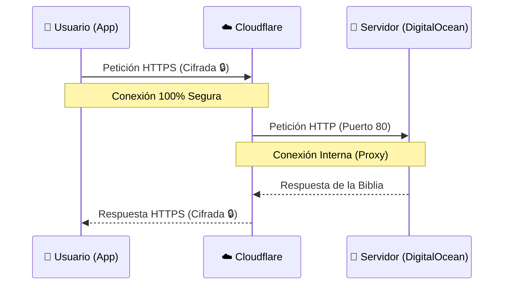

# ☁️ Arquitectura de Red y Seguridad SSL (Cloudflare)

Este documento explica cómo está configurada la seguridad de CatholicVerse para funcionar de forma profesional en un servidor de recursos limitados ($6/mes).

## 🛡️ Esquema de Seguridad "Flexible"

Actualmente usamos el modelo de **SSL Flexible** de Cloudflare. Así es como viajan los datos:

### 1. ¿Por qué usamos este modelo?
Instalar certificados SSL directamente en el servidor (con herramientas como Certbot o Nginx) requiere:
- Más memoria RAM.
- Renovaciones automáticas que pueden fallar.
- Configuración de Reverse Proxies complejos.

Al usar **Cloudflare Flexible**, delegamos la seguridad en ellos. El usuario **siempre ve el candadito verde** y sus datos viajan seguros por internet.

### 2. ¿Es seguro?
- **Para el usuario:** SÍ. Sus datos (email, contraseña, etc.) viajan encriptados desde su móvil hasta Cloudflare.
- **Entre Cloudflare y el Servidor:** Los datos viajan "en abierto". En una app de banca esto sería un riesgo, pero para CatholicVerse es una solución óptima y estándar en la industria para optimizar recursos.

### 3. Futura Mejora: "Full Strict"
Cuando la app crezca y subamos de plan a un servidor con más RAM, instalaremos un **Certificado de Origen de Cloudflare** dentro del servidor para que todo el camino, de principio a fin, sea 100% HTTPS.

---

## ⚙️ Configuración Actual (Checklist)

- **Puerto:** El servidor escucha en el puerto **80** (mapeado internamente al 8080 de la API).
- **Firewall:** DigitalOcean permite la entrada por los puertos **22 (SSH)** y **80 (HTTP)**.
- **DNS:** `api.getcatholicverse.com` apunta a la IP `137.184.139.1` con la nube naranja activa (Proxy).
- **SSL en Cloudflare:** Configurado en modo **Flexible**.
