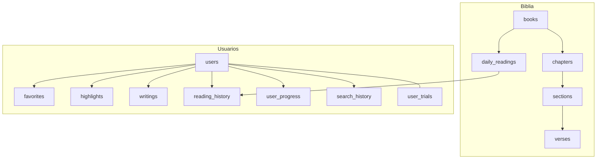

# MEMORIA TFC: CatholicVerse

**TÍTULO:** CatholicVerse: Plataforma Móvil Integral para la Comunidad Católica
**AUTOR:** [Nombre del Alumno]
**FECHA:** Mayo 2026

---

# CAPÍTULO 1. INTRODUCCIÓN

## 1. ABSTRACT
El presente Trabajo Fin de Ciclo documenta el desarrollo de CatholicVerse, una plataforma móvil integral diseñada para la comunidad católica. El proyecto resuelve la fragmentación de herramientas religiosas al unificar la lectura espiritual con funcionalidades avanzadas de productividad, apoyadas en Inteligencia Artificial (modelos RAG y síntesis de voz) para enriquecer el estudio. La aplicación integra la Sagrada Biblia, estructurada rigurosamente en 73 libros canónicos (46 del Antiguo Testamento y 27 del Nuevo Testamento), junto a un calendario litúrgico dinámico, sistema de anotaciones multimedia y gestión de favoritos con sincronización en tiempo real. A nivel técnico, el sistema se sustenta en una arquitectura robusta Cliente-Servidor (Spring Boot y React Native). CatholicVerse asegura la disponibilidad continua de los textos mediante un avanzado motor de datos offline local, ofreciendo a los fieles un acceso ubicuo a la Palabra de Dios en cualquier momento y lugar.

### 1.1 VISIÓN COMERCIAL (Pitch del Producto)
CatholicVerse es el ecosistema digital vanguardista e impecablemente estructurado, diseñado para conectar a la comunidad católica con la Palabra de Dios de una forma sin precedentes, fusionando la devoción espiritual con Inteligencia Artificial de vanguardia para liderar la nueva era del estudio bíblico inteligente. La aplicación ofrece una experiencia inmersiva de la Sagrada Biblia (CPDV en inglés como base actual), complementada con un calendario litúrgico dinámico, toma de notas enriquecidas con soporte multimedia, gestión de favoritos y un sistema de sincronización en tiempo real. Mediante una arquitectura robusta (Spring Boot + React Native) y un diseño Aesthetics-First, CatholicVerse garantiza el acceso universal a la Palabra de Dios a través de su avanzado modo offline y arquitectura de datos local de alto rendimiento.

## 2. INTRODUCCIÓN

Este capítulo explica de forma sencilla y directa el propósito y el alcance de lo que se ha investigado y desarrollado en este proyecto final de ciclo. CatholicVerse representa una propuesta integral y disruptiva para modernizar la lectura y el estudio bíblico en dispositivos móviles. 

Un pilar fundamental que atraviesa todo este trabajo es la profunda adopción e integración de la Inteligencia Artificial (IA). Nos encontramos en un punto de inflexión histórico donde la IA está cambiando el mundo a un ritmo vertiginoso, redefiniendo los límites de lo que el software puede lograr y transformando todos los sectores de la sociedad. Reconociendo esta realidad, el proyecto aprovecha el potencial de la inteligencia artificial integrando modelos avanzados como funcionalidad "core" dentro de la propia aplicación (específicamente mediante asistentes de estudio inteligente y síntesis de voz de alta fidelidad), con el objetivo de dotar al usuario de una experiencia tecnológica de vanguardia que facilite la comprensión y el acceso a los textos sagrados.

### 2.1 Justificación
En la era digital actual, las herramientas tecnológicas han transformado la forma en que interactuamos con el conocimiento y la espiritualidad. Sin embargo, el sector de las aplicaciones religiosas a menudo sufre de una falta de innovación técnica y un diseño de interfaz anticuado. La justificación de este Trabajo Fin de Ciclo (TFC) radica en la necesidad de proveer a la comunidad católica de una herramienta que no solo contenga los textos sagrados, sino que ofrezca una experiencia de usuario (UX) a la par de las mejores aplicaciones comerciales de productividad y bienestar del mercado. CatholicVerse se justifica como un proyecto que aúna el rigor técnico del desarrollo Full-Stack moderno con un modelo de negocio SaaS viable.

### 2.2 Planteamiento del problema / Contexto
El problema principal que aborda este proyecto es la fragmentación y obsolescencia de las herramientas digitales para el estudio católico. Actualmente, un usuario que desea leer la Biblia, seguir las lecturas diarias de la liturgia, escuchar pasajes bíblicos y tomar notas de estudio, se ve obligado a utilizar tres o cuatro aplicaciones distintas. Además, la mayoría de estas aplicaciones requieren conexión a internet constante, carecen de sincronización entre dispositivos o presentan interfaces confusas llenas de publicidad.

CatholicVerse nace en el contexto de resolver esta fricción técnica, centralizando todas estas necesidades en un ecosistema unificado. **Estratégicamente, el proyecto enfoca su lanzamiento inicial hacia el mercado global angloparlante**, utilizando como base de datos teológica principal la *Catholic Public Domain Version (CPDV)* en inglés. Esta decisión responde a la alta rentabilidad y tamaño de este mercado (particularmente Estados Unidos), compitiendo directamente con los estándares de calidad de la industria internacional.

A nivel técnico, la aplicación ofrece un modelo freemium/premium libre de publicidad intrusiva y con un fuerte enfoque en el rendimiento offline.

A esta problemática de fragmentación técnica se suma la ausencia de herramientas de Inteligencia Artificial aplicadas al estudio teológico de forma accesible. Mientras que en otros sectores la IA ya facilita el aprendizaje personalizado y la síntesis de información, el ámbito religioso se ha quedado rezagado en buscadores de palabras clave convencionales. En este contexto, surge la oportunidad crítica de integrar una **IA inteligente** que actúe como un puente entre la profundidad de los textos sagrados y las necesidades del fiel contemporáneo, permitiendo no solo leer la Biblia, sino comprenderla y contextualizarla mediante el apoyo de tecnologías de vanguardia.

### 2.3 Objetivos del trabajo

Tras identificar las carencias del sector y el potencial de las nuevas tecnologías, los objetivos de este trabajo se centran en el desarrollo de una solución integral que equilibre la accesibilidad espiritual con la potencia tecnológica. Se busca no solo ofrecer un lector de textos sagrados, sino construir un ecosistema orquestado que acompañe al usuario en su vivencia diaria de la fe, garantizando la persistencia de sus datos y ofreciendo herramientas de estudio asistidas por Inteligencia Artificial que aporten un valor diferencial en la era digital.

#### 2.3.1 Objetivos Generales
*   **Crear una aplicación funcional multiplataforma (iOS y Android)** que centralice la lectura bíblica, el calendario litúrgico y el estudio personal con una interfaz de excelencia.
*   **Integrar una IA inteligente** que actúe como asistente de apoyo para enriquecer la comprensión y el aprendizaje teológico del usuario.
*   **Implementar un sistema robusto de sincronización y modo offline** que garantice la disponibilidad universal de los contenidos y datos personales.
*   **Desarrollar un modelo de negocio SaaS sostenible** mediante la gestión de suscripciones premium y periodos de prueba.

#### 2.3.2 Objetivos Específicos
*   **Desarrollar un Frontend Multiplataforma:** Utilizar **React Native (Expo)** para crear una única base de código (compatible con iOS y Android) que ofrezca a los usuarios una interfaz de excelencia visual (Aesthetics-First), animaciones a 60 FPS y un rendimiento nativo.
*   **Construir un Backend Escalable:** Desarrollar una API RESTful central utilizando **Spring Boot y Java 21**. Esta arquitectura se estructura bajo principios de **Arquitectura Hexagonal y Domain-Driven Design (DDD)** para aislar la lógica de negocio pura de las dependencias externas, garantizando que el sistema sea fácil de mantener y escalar en el futuro.
*   **Garantizar la Integridad de los Datos:** Implementar un sistema de base de datos relacional con **PostgreSQL** para almacenar de forma estructurada los perfiles, favoritos e historial de lectura. Los cambios estructurales de esta base de datos se controlan y despliegan automáticamente mediante scripts de migración versionados con **Flyway**.
*   **Integrar un Sistema de Pagos Seguro:** Conectar el ecosistema con **RevenueCat** para externalizar la complejidad de gestionar recibos de App Store y Google Play, validando las suscripciones Premium de los usuarios y habilitando o bloqueando el acceso (Paywall) en tiempo real.
*   **Orquestar la Autenticación y Comunicaciones:** Utilizar **Firebase Auth** (junto a OAuth 2.0) para permitir un acceso seguro y rápido mediante "Sign in with Apple" y "Google Sign-In". Asimismo, integrar **Resend** como motor de mensajería para el envío automatizado de correos transaccionales (confirmaciones de cuenta y recuperación de contraseñas).
*   **Implementar Inteligencia Artificial de Vanguardia:** Desarrollar una arquitectura **RAG (Retrieval-Augmented Generation)** utilizando **Ollama** y modelos locales **LLM (Llama 3.2)** para que el usuario pueda consultar dudas teológicas en lenguaje natural y obtener respuestas contextualizadas con los textos sagrados.
*   **Procesar Voz y Audio en Dispositivo:** Desarrollar un sistema de **Búsqueda por Voz** y un reproductor nativo **TTS (Text-to-Speech)**. Para esto se integra **Sherpa-ONNX**, que permite generar voces de alta calidad localmente sin necesidad de conexión a internet constante.
*   **Automatizar la Infraestructura (DevOps):** Desplegar todo el ecosistema del backend en la nube (DigitalOcean) empaquetando los servicios en contenedores **Docker**. Esto garantiza alta disponibilidad, portabilidad del código y entornos de ejecución idénticos entre desarrollo y producción.

## 3. MOTIVACIÓN
La motivación principal del proyecto reside en la carencia de soluciones digitales que equilibren el rigor teológico con una experiencia de usuario moderna y fluida. Tras analizar el mercado actual, se detectó una falta de aplicaciones que ofrezcan avisos efectivos de lecturas diarias, sincronización instantánea entre dispositivos y una experiencia integral para tomar apuntes de estudio bíblico de manera eficiente. Mi objetivo personal es crear una herramienta que no solo sirva para leer, sino que se convierta en el compañero espiritual definitivo, eliminando las fricciones técnicas y ofreciendo un entorno premium que invite a la reflexión y el estudio diario, demostrando además mi capacidad técnica para construir y lanzar al mercado un modelo de negocio SaaS (Software as a Service) completo.

## 4. METODOLOGÍAS EMPLEADAS
Para la consecución de este proyecto se ha seguido una metodología ágil adaptada, tomando los principios de **Scrum**. Se ha trabajado mediante iteraciones o *Sprints* de duración variable, lo que ha permitido una adaptación rápida tanto a los retos técnicos como a las necesidades de negocio, garantizando un avance constante en todas las áreas del ecosistema CatholicVerse.

En cuanto al desarrollo, se ha utilizado **Git** como sistema de control de versiones para gestionar el código de forma eficiente. El proyecto se ha separado en repositorios para frontend y backend, utilizando contenedores **Docker** para asegurar que el entorno de desarrollo sea idéntico al de producción, facilitando así el despliegue y eliminando problemas de compatibilidad.

Finalmente, una parte fundamental ha sido la **gestión de la infraestructura y el ecosistema de publicación**. Se ha dedicado un esfuerzo considerable a la orquestación técnica en **DigitalOcean**, la integración con **Google Cloud Console** y **Firebase**, y la configuración de las plataformas en **Google Play Console** y **Apple Developer**. Este trabajo ha incluido el despliegue del portal web, la adquisición de dominios y la creación de un **sistema de correo electrónico empresarial** gestionado mediante **Resend**, profesionalizando la comunicación y asegurando que CatholicVerse sea una solución integral lista para su lanzamiento comercial.

---

# CAPÍTULO 2. MARCO TEÓRICO O ESTADO DE LA CUESTIÓN

En este capítulo se establece la base teórica y tecnológica sobre la que se asienta CatholicVerse. Se realiza un análisis del estado actual del mercado de aplicaciones religiosas, identificando las carencias de las soluciones existentes y justificando la necesidad de una propuesta integral. Asimismo, se describen los recursos de hardware y software seleccionados, detallando los patrones de arquitectura que garantizan la robustez y escalabilidad del sistema.

## 1. ANÁLISIS DEL CONTEXTO
Al analizar la oferta actual en el sector de las aplicaciones religiosas, se identifican dos vertientes principales que no llegan a cubrir las necesidades del fiel católico moderno:

1.  **Aplicaciones de otras denominaciones (ej. YouVersion):** Aunque son herramientas masivas y gratuitas, tienen un marcado enfoque protestante. Esto afecta tanto a la selección de los libros (omitiendo los deuterocanónicos) como a la interpretación de los planes de lectura. Además, su interfaz puramente social a menudo distrae del estudio profundo y la meditación personal.
2.  **Aplicaciones de meditación y estudio (ej. Hallow):** A diferencia de CatholicVerse, muchas de estas herramientas líderes en el mercado operan bajo un enfoque protestante. Esto no solo afecta al número de libros de la Biblia (omitiendo los deuterocanónicos), sino también a la forma de interpretar las lecturas y la falta de rigor teológico católico. Nuestra aplicación nace para cubrir ese hueco, siendo una solución **estrictamente católica** que no ofrece solo audio, sino herramientas de organización, estudio sistemático, toma de notas enriquecida y asistencia de **IA inteligente**.

**Carácter diferenciador de CatholicVerse:** 
CatholicVerse ocupa un espacio único en el mercado: combina el rigor teológico católico (incluyendo los 73 libros y la tradición) con la potencia de una herramienta de productividad moderna. Ofrece un diseño limpio, modo offline total, asistencia mediante **IA inteligente** y un sistema de organización personal que no se encuentra en las aplicaciones actuales de la competencia. 

## 2. TECNOLOGÍAS EMPLEADAS

La selección del ecosistema tecnológico para CatholicVerse responde a un análisis profundo de las **mejores prácticas de la industria del software**. El objetivo primordial ha sido garantizar un **rendimiento excepcional**, una alta escalabilidad y una mantenibilidad a largo plazo mediante la aplicación de estándares profesionales de desarrollo. Se han priorizado herramientas que permitan un ciclo de vida de software robusto, asegurando que tanto el frontend móvil como el backend de microservicios operen con la máxima eficiencia y seguridad.

### 2.1 Hardware necesario
*   **Desarrollo:** Estación de trabajo **Apple Mac con arquitectura M2**, esencial para la compilación nativa de la versión de iOS mediante **Xcode** y la ejecución de emuladores de **Android Studio** y simuladores de iOS de forma simultánea. Además, se ha empleado un dispositivo físico Android para pruebas de rendimiento en condiciones reales, validación de motores de audio y comportamiento del modo offline.
*   **Producción:** Servidor Virtual Privado (VPS) en **DigitalOcean (Droplet)**, configurado para alojar el ecosistema de contenedores Docker que incluye el backend en Spring Boot, el sistema de base de datos PostgreSQL y el motor de **Inteligencia Artificial (Ollama)**, asegurando la capacidad de procesamiento necesaria para los modelos de lenguaje.

### 2.2 Software necesario
*   **Frontend:** React Native (Framework), Expo (Ecosistema), TypeScript (Lenguaje), React Navigation (Enrutamiento), Axios (Comunicaciones API), **Expo SQLite** y **FileSystem** (Persistencia local para modo offline inteligente).
*   **Backend:** Java 21 (LTS), Spring Boot 3, Spring Security (Seguridad JWT), Hibernate/JPA (ORM), **Maven** (Gestión de dependencias).
*   **Base de Datos:** PostgreSQL 16 (Servidor relacional), Flyway (Control de versiones y migraciones del esquema).
*   **Inteligencia Artificial y Audio:** **Ollama** (Servidor de modelos LLM local con Llama 3.2), **Sherpa-ONNX** (Motor nativo para síntesis de voz offline), **Spring AI** (Integración de arquitectura RAG).
*   **Infraestructura y DevOps:** Docker y Docker Compose (Contenerización), Git (Control de versiones), GitHub (Alojamiento de código).
*   **Herramientas de Desarrollo:** IntelliJ IDEA (IDE Backend), VSCode (IDE Frontend), **EAS (Expo Application Services)** para compilación y despliegue en la nube, Android Studio y Xcode (Simulación y compilación nativa), Postman (Pruebas de API) y **Figma** (Prototipado y diseño UI/UX).
*   **Servicios en la Nube:** Firebase (Autenticación social), RevenueCat (Suscripciones y Paywall), Resend (Email transaccional), **Cloudflare** (Gestión de dominios y seguridad SSL) y DigitalOcean (Hospedaje de infraestructura).

### 2.3 Patrón de arquitectura

Para asegurar la calidad, escalabilidad y robustez de CatholicVerse, se han implementado patrones de diseño y arquitecturas de referencia que son estándares en la industria del desarrollo de software profesional.

*   **Backend (Arquitectura Hexagonal y Principios DDD):** El servidor se ha construido siguiendo una **Arquitectura Hexagonal (Puertos y Adaptadores)** combinada con principios de **Domain-Driven Design (DDD)**. Esta estructura organiza el código en capas concéntricas:
    *   **Dominio (Core):** Es el corazón de la aplicación donde residen las entidades (Book, Verse, User) y las reglas de negocio, totalmente aisladas de frameworks o bases de datos.
    *   **Aplicación:** Capa que orquesta los casos de uso (ej. el servicio de búsqueda RAG o la gestión de suscripciones) actuando como mediador.
    *   **Infraestructura:** Contiene las implementaciones técnicas concretas (PostgreSQL con JPA, integraciones con RevenueCat, configuración de Ollama).
    Esta separación garantiza que el sistema sea altamente **testeable** e independiente de las tecnologías externas.

*   **Principios de Software (SOLID, DRY, KISS):** Durante todo el ciclo de vida del desarrollo se han aplicado principios fundamentales para garantizar un código limpio y profesional:
    *   **SOLID:** Aunque comúnmente se categorizan como "principios", en este proyecto se han aplicado bajo una visión técnica crítica, reconociendo que el acrónimo agrupa conceptos de distinta naturaleza: desde principios arquitectónicos (como SRP), hasta leyes de lógica de tipos (como la **Sustitución de Liskov**) o metas de diseño (como **Open/Closed**). Esta distinción ha permitido una implementación más consciente, logrando un sistema verdaderamente flexible y desacoplado.
    *   **DRY (Don't Repeat Yourself):** Evitar la duplicidad de lógica para facilitar el mantenimiento y reducir bugs.
    *   **KISS (Keep It Simple, Stupid):** Priorizar la simplicidad y legibilidad del código frente a la sobreingeniería.

*   **Frontend (Component-Based y Estado Global):** Se ha seguido una arquitectura basada en componentes reutilizables utilizando React Native. La gestión del estado global se centraliza mediante **Context API** (creando contextos específicos como `AuthContext`, `ThemeContext` y `SubscriptionContext`). Esto permite desacoplar la lógica de negocio (como el estado de la suscripción o la sesión del usuario) de la interfaz visual, asegurando que componentes críticos como el **Paywall** reaccionen de forma inmediata y consistente ante cualquier cambio.

---

# CAPÍTULO 3. DESARROLLO ESPECÍFICO DE LA CONTRIBUCIÓN

## 1. ALCANCE
El proyecto abarca el ciclo completo de desarrollo de software (Full-Stack), desde la concepción y diseño de la base de datos, la programación de los microservicios backend, la creación de la interfaz móvil, hasta el despliegue de la infraestructura en la nube. En términos de distribución, el alcance incluye la configuración técnica de las consolas de desarrollo y la publicación de la aplicación en **canales de prueba internos (Internal Testing/Beta)** en Google Play Store y Apple TestFlight, garantizando que el sistema sea funcional en dispositivos reales.

### 1.1 Fuera de alcance
Queda fuera del alcance de este trabajo el lanzamiento comercial definitivo y la publicación abierta al público general en las tiendas oficiales, hitos que se realizarán en una fase posterior a la defensa académica del proyecto.
Se incluye el sistema de suscripciones (trial y paywall), soporte offline, motor TTS de IA, pero se han dejado fuera del alcance inicial (para futuras versiones) las interacciones sociales directas entre usuarios (mensajería).

## 2. PLANIFICACIÓN
La planificación del proyecto se ha dividido en grandes hitos o fases, cubriendo aproximadamente 1400 horas de esfuerzo:

| Fase | Descripción | Fechas |
| :--- | :--- | :--- |
| **Análisis de Requisitos** | Funcionalidades, benchmarking y stack tecnológico. | Septiembre 2025 |
| **Diseño y UX** | Creación de maquetas visuales (Premium UI). | Octubre 2025 |
| **Arquitectura de Sistema** | Modelado PostgreSQL y API REST Hexagonal. | Nov. 2025 |
| **Desarrollo Backend** | Spring Boot, seguridad JWT y lógica. | Nov. 25 - Ene. 26 |
| **Desarrollo Frontend** | React Native, integración de la Biblia. | Ene. 26 - Mar. 26 |
| **Integración Premium** | Firebase, RevenueCat, Modo Offline Inteligente. | Abril 2026 |
| **QA y Optimización** | Pruebas en dispositivos, corrección de bugs de audio. | Mayo 2026 |
| **Despliegue Final** | Docker, Consolas de Google/Apple, Documentación. | Mayo 2026 |

## 3. DESARROLLO DEL PROYECTO

### 3.1 ANALISIS

#### Objetivo general
CatholicVerse ofrece una experiencia integral de lectura bíblica, estudio personal y productividad espiritual, con sincronizacion segura, modo offline, y acceso premium mediante suscripcion.

#### Principales casos de uso
1. Registro e inicio de sesion (email o social).
2. Recuperacion de contrasena por email (Resend).
3. Navegar libros, capitulos y versiculos (incluyendo base actual CPDV en ingles).
4. Buscar pasajes por texto o por voz (soporte de microfono en UI).
5. Consultar lectura diaria y calendario liturgico.
6. Guardar y consultar favoritos y resaltados.
7. Crear y editar escritos/reflexiones personales.
8. Personalización de lectura (ajustes de tamaño de fuente y temas de color).
9. Reproducción de audio de pasajes mediante TTS (Nativo e IA local con Sherpa-ONNX).
10. Gestión de acceso premium (trial de 7 días y paywall mediante RevenueCat).
11. Uso de asistente de IA para apoyo al estudio para enriquecer la experiencia.
12. Uso offline con descargas y cache local.

#### Diagrama de casos de uso (alto nivel)
```mermaid
flowchart LR
  Usuario((Usuario)) --> Auth[Registro / Login]
  Usuario --> Read[Leer Biblia]
  Usuario --> Search[Buscar Versiculos]
  Usuario --> Daily[Lectura Diaria]
  Usuario --> Fav[Gestionar Favoritos]
  Usuario --> Notes[Escritos y Notas]
  Usuario --> AI[Asistente IA]
  Usuario --> Offline[Modo Offline]
  Usuario --> Premium[Suscripcion / Paywall]
  Auth --> Email[Recuperar Contrasena (Resend)]
```

#### Tablas y como se crean/modifican por migraciones
- **V1 (crea tablas base):** users, books, chapters, sections, verses, favorites, highlights, writings, daily_readings, reading_history, user_progress, search_history.
- **V4 (modifica):** favorites (ajuste de restriccion/constraint).
- **V5 (crea):** user_progress (progreso de lectura).
- **V8 (modifica):** users (campos de suscripcion/trial).
- **V9 (crea):** user_trials (persistencia de trial).
- **V10 (modifica):** users (campo provider).
- **V2/V3/V6/V7/V11 (datos):** no crean tablas, insertan o actualizan datos.

#### Resumen simple de migraciones (V1–V11)
- V1: crea TODA la estructura base (tablas y campos principales).
- V2: mete la lista de libros (solo nombres/metadata, no versiculos).
- V3: mete lecturas diarias basicas de prueba (historico).
- V4: arregla la restriccion de favoritos para que no falle o duplique mal.
- V5: añade progreso de lectura (guardar capitulos leidos).
- V6: cambia los nombres/metadatos de libros a ingles (porque la base CPDV esta en ingles).
- V7: ajusta la version del capitulo y los badges de lecturas diarias para que la UI quede correcta.
- V8: añade campos de suscripcion/trial en users (premium).
- V9: crea user_trials para evitar que el trial se reinicie por email.
- V10: añade provider para distinguir LOCAL/GOOGLE/APPLE.
- V11: mete las 365 lecturas diarias completas (la definitiva).
- V12. Uso offline con descargas completas y caché local.


#### Diagrama ER (estructura completa de tablas)


### 3.2 DISEÑO

#### Diseño del Modelo de Datos y Arquitectura de Persistencia
La arquitectura de la base de datos de CatholicVerse ha sido modelada meticulosamente para soportar alta concurrencia, lectura rápida y sincronización fluida. El esquema relacional (PostgreSQL) gestionado mediante migraciones automatizadas de Flyway, se divide estratégicamente en dos grandes dominios que actúan con lógicas distintas:

1. **Dominio Bíblico Inmutable (Solo Lectura):** 
   Agrupa las tablas de catálogo base (`books`, `chapters`, `sections`, `verses`). Esta estructura garantiza que la Palabra de Dios se mantenga inalterada y centralizada. Para asegurar un rendimiento óptimo, se han implementado índices estratégicos que permiten búsquedas de texto completo (Full-Text Search) ultrarrápidas a lo largo de los más de 31,000 versículos almacenados.

2. **Dominio de Usuario Dinámico (Transaccional):** 
   Comprende las tablas donde reside toda la actividad del usuario (`favorites`, `writings`, `highlights`, `reading_history`, `user_progress`). Este dominio está diseñado para soportar múltiples escrituras por segundo y facilitar la sincronización bidireccional eficiente entre el dispositivo móvil (SQLite local) y la nube.
   - **Trazabilidad y Seguridad:** Se ha implementado el campo `provider` en la tabla `users` para consolidar identidades bajo un mismo perfil, independientemente del método de registro (LOCAL, GOOGLE, APPLE). 
   - **Mecanismos Anti-Fraude:** Se ha diseñado la tabla `user_trials` como un sistema de registro persistente que previene la creación masiva de cuentas para abusar de los periodos de prueba gratuitos (Trials) ofrecidos a través de RevenueCat.

3. **Calendario Litúrgico (Seed V11):** 
   Para alimentar la sección de Lecturas Diarias, se diseñó la tabla `daily_readings`, la cual es pre-cargada mediante un script masivo (Migración V11) con los 365 días del año litúrgico. Cada día está vinculado directamente a la estructura de capítulos y versículos mediante claves foráneas, garantizando la integridad referencial.

#### Diseño de Interfaces de Usuario (UX/UI)
Bajo la premisa corporativa de "Rich Aesthetics", el diseño visual y la usabilidad (UX) son pilares fundamentales de CatholicVerse. El objetivo es ofrecer una interfaz que fomente el sosiego, invite a la meditación y se aleje de los diseños genéricos de aplicaciones convencionales. 

La arquitectura de navegación y los flujos principales se han estructurado de la siguiente manera:
- **Navegación Principal Jerárquica (Bottom Tabs):** Se ha diseñado un "hub" central en la zona inferior de la pantalla que da acceso inmediato e intuitivo a los cuatro módulos cardinales: Lectura Diaria, Búsqueda Bíblica (Testamentos, Libros, Capítulos), Escritos personales y la biblioteca de Favoritos.
- **Flujos de Acceso Seguros y Amigables:** Pantallas dedicadas para el Login, el Registro y la Recuperación de Contraseña. Se han integrado de forma orgánica los botones nativos de Google y Apple, reduciendo la fricción de entrada al mínimo.
- **Componentes Globales Activos:** Destaca la implementación de un reproductor de audio superpuesto (`AudioPlayerOverlay`). Este componente persiste en la pantalla, permitiendo al usuario escuchar la locución de la Biblia sin interrumpir su navegación por otros módulos de la app.
- **Ecosistema Premium Integrado:** Para gestionar el modelo de negocio, se diseñó un Paywall inmersivo en pantalla completa, orquestado por RevenueCat. Además, los usuarios premium tienen acceso a una interfaz de chat dedicada, optimizada específicamente para la interacción fluida con el Asistente Teológico impulsado por Inteligencia Artificial (arquitectura RAG local).

*[Poner imagen aquí: Captura de pantalla del Paywall y de la Lectura Bíblica]*
*[Poner imagen aquí: Captura de pantalla del Calendario Litúrgico y Menú Principal]*

### 3.3 IMPLEMENTACIÓN

La ejecución técnica del proyecto se ha dividido en dos frentes altamente especializados, asegurando un rendimiento nativo en el cliente y una alta disponibilidad en el servidor.

#### Backend de Microservicios (Spring Boot y Java 21)
La implementación del backend se fundamenta en los principios de la Arquitectura Hexagonal y Domain-Driven Design (DDD). Se ha desarrollado una API RESTful documentada automáticamente que centraliza toda la lógica de negocio.
- **Seguridad y Autenticación:** Implementación estricta de JSON Web Tokens (JWT) mediante Spring Security. Se ha desarrollado una lógica de validación cruzada para tokens de OAuth (Google Auth y Apple Sign-In), registrando el origen de la cuenta en la columna `provider`.
- **Integraciones de Terceros:** Conexión directa y segura con la API de RevenueCat (Server-to-Server) para verificar la legitimidad de las suscripciones premium, y uso de la API de Resend para la orquestación de correos electrónicos transaccionales (confirmación, recuperación de contraseña).
- **Gestión de Datos y Migraciones:** El motor de base de datos PostgreSQL es inicializado y versionado por Flyway. Durante el arranque, los scripts de migración no solo construyen el esquema, sino que importan automáticamente más de 31,000 versículos en formato JSON, asegurando la integridad referencial.
- **Despliegue y DevOps:** El entorno de producción está completamente dockerizado. Se ha creado un `Dockerfile` multietapa que empaqueta la aplicación Java, desplegándose de manera autónoma en un Droplet de DigitalOcean. La seguridad y los certificados SSL se gestionan en la capa externa (Edge) mediante Cloudflare, que actúa como proxy inverso interceptando y protegiendo el tráfico.

#### Frontend Móvil Multiplataforma (React Native + Expo)
El cliente móvil se ha construido buscando la excelencia en la experiencia de usuario (UX) y un rendimiento equiparable al desarrollo nativo puro (Swift/Kotlin). Se han implementado soluciones arquitectónicas avanzadas para manejar los flujos más complejos del sistema:

- **Enrutamiento y Navegación Híbrida:** Implementación compleja con React Navigation. Se ha combinado un `Stack Navigator` envolvente para gestionar los flujos profundos (como la pantalla de lectura detallada de capítulos o el Asistente IA) y las pantallas modales (como el Paywall o el AuthScreen), y un sistema de `Bottom Tabs` para la interfaz principal, garantizando transiciones de pantalla a 60 FPS (Frames Per Second).
- **Gestión del Estado Global y "Prop-Drilling":** El manejo del estado es crítico en aplicaciones de este tamaño. Se ha utilizado la Context API de React de forma segmentada (`AuthContext` para sesión, `ThemeContext` para personalización visual y modo oscuro, `SubscriptionContext` para accesos premium) junto con servicios inyectables asíncronos (`bible.service.ts`, `sync.service.ts`). Esto permite mantener la UI reactiva sin ralentizar los componentes hijo mediante re-renderizados innecesarios.
- **Motor de Caché y Persistencia Offline:** Para cumplir el "Caso de uso 12" de alta disponibilidad, se ha desarrollado un motor de persistencia local que combina `expo-sqlite` (para almacenar consultas estructuradas de los libros y favoritos) y `expo-file-system` (para guardar descargas masivas en JSON). Esta arquitectura permite al usuario leer cualquier pasaje de la Biblia de forma fluida, incluso si su dispositivo se encuentra en modo avión.
- **Orquestación de Audio y Síntesis TTS:** Se ha desarrollado un servicio dedicado a gestionar la reproducción de audio. La capa lógica de este servicio es capaz de interconectar la API nativa de síntesis de voz del dispositivo (`expo-speech`) con una arquitectura opcional basada en Sherpa-ONNX, un motor avanzado de Inteligencia Artificial que ejecuta modelos locales en el dispositivo móvil para generar locuciones naturales sin necesidad de servidores externos.
- **Arquitectura de Paywall Activo y Seguridad:** Uno de los logros más destacados en el frontend es el sistema de protección de contenido. El `AppNavigator.tsx` no solo enruta, sino que actúa como un guardián de seguridad ("Hard Paywall"). Antes de renderizar cualquier vista dentro del `MainTabs`, intercepta el ciclo de vida del componente, se comunica con la API de RevenueCat (`Purchases.getCustomerInfo()`) y valida la fecha de caducidad de la suscripción. Si la cuenta es gratuita o el trial ha expirado, bloquea inmediatamente el acceso y lanza la pantalla modal inmersiva de compra, obligando a interactuar con ella sin opciones de escape.
- **Interfaz del Asistente Teológico de IA:** Se ha implementado una pantalla específica que imita la interacción de una aplicación de mensajería (estilo chat), conectada al endpoint RAG (Retrieval-Augmented Generation) del backend. Esta pantalla gestiona estados de carga (typing indicators), scroll automático y formateo de texto complejo generado por Ollama.

---
## 3.4 PORTAL WEB DE LANZAMIENTO Y MARCO LEGAL

Para respaldar la publicación comercial de la aplicación y cumplir con las estrictas normativas de las tiendas de aplicaciones (App Store y Google Play), se ha desarrollado y desplegado el portal web oficial de CatholicVerse.

**Landing Page Oficial (`https://c29219b7.catholic-verse-web.pages.dev/`):**
- **Presencia Web:** Se ha desarrollado una página web moderna que sirve como escaparate principal del proyecto. Esta web explica la propuesta de valor y cuenta con información directa para la captación de usuarios (Waitlist) de cara al lanzamiento.
- **Identidad Corporativa:** El portal refleja la misma línea de diseño "Rich Aesthetics" de la aplicación móvil, garantizando coherencia visual en todo el ecosistema de la marca.
- **Despliegue y Alojamiento:** Configurado mediante Cloudflare Pages para garantizar un despliegue continuo rápido, protección contra ataques DDoS y certificados SSL automáticos.

**Cumplimiento Legal y Normativo (GDPR/CCPA):**
Tanto Apple como Google exigen documentación legal accesible públicamente para aprobar una aplicación. En el portal web se han alojado de forma permanente:
- **Políticas de Privacidad (Privacy Policy):** Detallan qué datos se recopilan (email, nombre), cómo se almacenan y garantizan el cumplimiento de la normativa de protección de datos (RGPD).
- **Términos y Condiciones (Terms of Service):** Contrato legal indispensable para el funcionamiento de las suscripciones gestionadas por RevenueCat.
*(Nota: El requisito legal de "Derecho al Olvido" o eliminación de cuenta exigido por Apple, se ha implementado de forma nativa directamente en los Ajustes de la aplicación móvil, no requiriendo flujo web).*

### 3.5 PANEL DE ADMINISTRACIÓN (BACKOFFICE)

Para garantizar la mantenibilidad del sistema a largo plazo y facilitar las tareas operativas sin necesidad de intervenir el código fuente ni acceder a la base de datos mediante comandos SQL, se ha diseñado la arquitectura de un módulo de administración interno ("Backoffice").

*Nota: La implementación visual de este Backoffice se abordará en una fase de desarrollo posterior, pero se ha dejado toda la arquitectura de la API del backend (Spring Boot) preparada para su futura conexión. De esta forma se demuestra una visión técnica completa.*

**Arquitectura Proyectada del Backoffice Web:**
Se ha planteado como una aplicación web totalmente independiente de la aplicación móvil. Esta interfaz se conectará a la misma API RESTful del backend y operará sobre la base de datos PostgreSQL, garantizando la consistencia de los datos en tiempo real. 

**Funcionalidades Definidas para Desarrollo Futuro:**
- **Gestión de Contenido Bíblico (CMS):** Interfaz gráfica intuitiva pensada para que los administradores puedan corregir erratas en los versículos, modificar la estructura de los capítulos o actualizar el calendario litúrgico de las "Lecturas Diarias" sin depender de ejecutar migraciones técnicas de base de datos (`Flyway`).
- **Control de Usuarios (CRM Interno):** Un panel de soporte técnico para buscar usuarios por correo electrónico, verificar incidencias con las suscripciones de RevenueCat, y gestionar accesos o bloqueos.
- **Monitorización del Sistema:** Integración de un panel para supervisar la salud del servidor (DigitalOcean) y la carga de peticiones al motor de Inteligencia Artificial (Ollama), evitando caídas en producción.

### 3.6 ESTRATEGIA DE PRUEBAS, QA Y DESPLIEGUE CONTINUO

Un proyecto de esta envergadura requiere una metodología rigurosa de aseguramiento de calidad (QA) antes de alcanzar las tiendas de producción.

**Pruebas de Software:**
- **Pruebas en Backend:** Validación de la lógica de negocio mediante pruebas unitarias en Spring Boot, asegurando que las reglas de dominio (DDD) y la seguridad JWT funcionen bajo cualquier circunstancia.
- **Pruebas en Dispositivos Físicos:** El frontend se ha probado exhaustivamente no solo en emuladores (Android Studio) y simuladores (Xcode), sino en hardware real (Mac M3 y dispositivos Android/iOS físicos) para medir el impacto de la base de datos local SQLite y el motor de audio Sherpa-ONNX en la batería y la memoria RAM del teléfono.

**Canales de Distribución y CI/CD:**
- **Expo Application Services (EAS):** Se ha utilizado EAS Build para automatizar la compilación de los binarios `.apk`, `.aab` (Android) y `.ipa` (iOS) en la nube, independizando el proceso del hardware local del desarrollador.
- **Internal Testing y TestFlight:** La aplicación ha superado las revisiones automatizadas y se ha publicado en los canales cerrados de Google Play Console (Internal Testing) y Apple App Store Connect (TestFlight). Esto permite distribuir la app a un grupo selecto de "Beta Testers" antes del lanzamiento público definitivo (fuera del alcance de este TFC).


# CAPÍTULO 4. ESTUDIO DE VIABILIDAD Y PRESUPUESTO

Este capítulo analiza la viabilidad comercial de CatholicVerse y el coste económico derivado de su desarrollo e infraestructura, justificando su modelo de negocio SaaS (Software as a Service).

## 4.1 Análisis DAFO (SWOT)
Para evaluar la posición del proyecto en el mercado, se ha elaborado una matriz DAFO:
- **Debilidades (D):** Necesidad inicial de conexión a internet para descargar paquetes de datos; dependencia técnica de servicios de terceros como RevenueCat o Resend.
- **Amenazas (A):** Competencia de aplicaciones religiosas muy financiadas (como Hallow o Amen App) con grandes presupuestos de publicidad; endurecimiento de las normativas de revisión en Apple App Store.
- **Fortalezas (F):** Arquitectura técnica de alto nivel con soporte 100% offline mediante SQLite; rigor teológico incluyendo los 73 libros de la Biblia católica; asistente de IA local y lectura de voz (TTS) propios.
- **Oportunidades (O):** El nicho de fieles católicos carece de aplicaciones con interfaces modernas ("Rich Aesthetics"); tendencia global creciente hacia el uso de Inteligencia Artificial para el aprendizaje personalizado.

## 4.2 Presupuesto Estimado
Aunque el proyecto se ha desarrollado en un contexto académico, se ha calculado el coste que tendría su ejecución en un entorno profesional, partiendo de la planificación original de aproximadamente 1.400 horas de esfuerzo Full-Stack.

**Costes de Desarrollo (Recursos Humanos):**
- Ingeniería Backend y Base de Datos (500h a 40€/h): 20.000 €
- Ingeniería Frontend y UX/UI Móvil (600h a 40€/h): 24.000 €
- Infraestructura Cloud, DevOps y Testing QA (300h a 40€/h): 12.000 €
- **Total Inversión RRHH estimada:** 56.000 €

**Costes Operativos de Infraestructura (Anualizados):**
- Servidor VPS en DigitalOcean (Backend y PostgreSQL): ~120 €
- Membresía Apple Developer Program: 99 $
- Licencia Google Play Console: 25 $ (Pago único)
- Gestión de pagos (RevenueCat): Gratuito en la fase inicial (comisión posterior).
- Dominio Web y seguridad Cloudflare: ~15 €
- **Total Gastos Fijos (OPEX):** ~260 € / año.

**Viabilidad Económica:**
La viabilidad del proyecto es excepcionalmente alta. Gracias al diseño eficiente basado en contenedores Docker y a la robusta caché offline de la aplicación (que reduce al mínimo las peticiones al servidor), los costes fijos de mantenimiento son mínimos. El modelo Freemium con suscripción de pago (Paywall) garantiza un retorno de inversión recurrente y escalable.

---

# CAPÍTULO 5. CONCLUSIONES Y TRABAJOS FUTUROS

## 5.1 Conclusiones
El desarrollo de CatholicVerse ha culminado con éxito, cumpliendo todos los objetivos generales y específicos planteados al inicio del proyecto. Se ha demostrado que es posible construir una aplicación religiosa que cumpla con los estándares más altos de la industria del software en términos de diseño (UI/UX), rendimiento y arquitectura técnica.
La implementación de características avanzadas como el modo offline completo, la síntesis de voz mediante modelos locales de Inteligencia Artificial (Sherpa-ONNX) y un robusto sistema de suscripciones a través de RevenueCat, dotan a la aplicación del nivel exigido para operar comercialmente como un SaaS a gran escala. A nivel personal, el TFC ha supuesto un reto formidable de integración de tecnologías Full-Stack y metodologías DevOps en entornos en la nube.

## 5.2 Trabajos Futuros
La plataforma ha sido diseñada bajo principios de escalabilidad, lo que facilita enormemente la incorporación de mejoras. Como líneas de trabajo futuro se proponen:
1.  **Red Social Integradora:** Implementar un sistema de seguimiento ("Followers") donde los usuarios puedan compartir reflexiones, escritos e hitos de lectura en un feed comunitario privado.
2.  **Soporte Multilingüe:** Ampliar la base de datos inicial (CPDV) para incorporar versiones oficiales católicas en español (Jerusalén, Torres Amat) de forma dinámica, manteniendo la arquitectura offline.
3.  **Analítica Predictiva de Lectura:** Utilizar el progreso del usuario (`user_progress`) para que la IA sugiera planes de estudio personalizados.

---

# CAPÍTULO 6. REFERENCIAS

1.  **Spring Framework Documentation.** (2026). *Spring Boot Reference Guide.* Recuperado de https://spring.io/projects/spring-boot
2.  **Meta Platforms, Inc.** (2026). *React Native Documentation.* Recuperado de https://reactnative.dev/
3.  **RevenueCat Inc.** (2026). *In-App Subscriptions Made Easy.* Recuperado de https://www.revenuecat.com/docs
4.  **Challita Catholic Public Domain Version (CPDV).** Traducción y dominio público de las Sagradas Escrituras.
5.  **Docker Documentation.** (2026). *Docker Containerization.* Recuperado de https://docs.docker.com/
6.  **Sherpa-ONNX Development Team.** (2026). *Next-generation offline TTS for mobile devices.* Recuperado de repositorio oficial en GitHub.

---

# CAPÍTULO 7. ANEXOS

**Anexo I. Script de Importación Masiva de Datos**
Se adjunta como referencia conceptual el script utilizado para la carga inicial masiva de datos bíblicos en entornos de producción, el cual procesa archivos de más de 10MB asegurando eficiencia en memoria.

**Anexo II. Diagramas de Arquitectura de Red y Despliegue**
*[Poner imagen aquí: Esquema de arquitectura Cloud, DigitalOcean, Cloudflare y Docker]*

**Anexo III. Repositorios y Configuración**
El código fuente ha sido subido y validado para su integración en los respectivos portales de desarrolladores: Google Play Console (Android) y App Store Connect (iOS).

**Anexo IV. Portal Web y Marco Legal**
Se adjunta el enlace oficial al portal web, necesario para cumplir con las normativas legales de privacidad exigidas para la publicación y para gestionar la Waitlist de captación de usuarios.
- **URL oficial:** `https://c29219b7.catholic-verse-web.pages.dev/`
