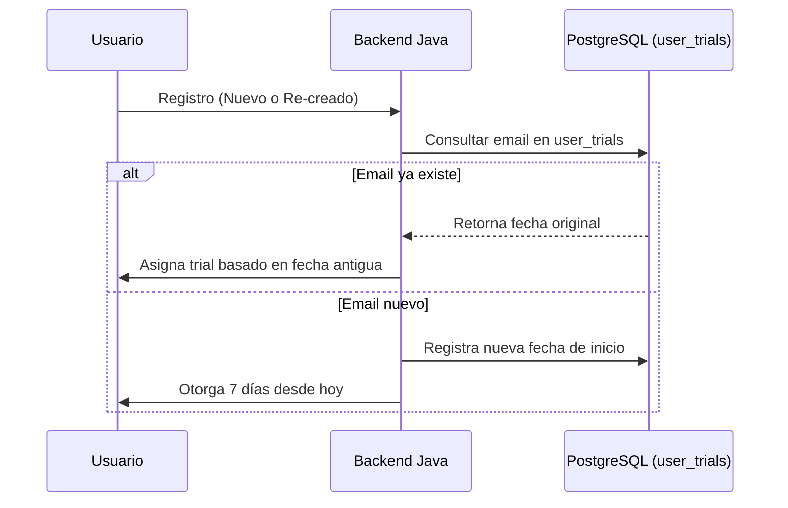

# 🛡️ Hito: Autenticación Blindada y Sistema Anti-Fraude (Trial)

Este documento certifica la implementación de la infraestructura de seguridad para el lanzamiento de **CatholicVerse**, protegiendo el periodo de prueba y mejorando la UX del login social.

## 🕒 1. Sistema de Persistencia de Prueba (7 Días)
Se ha implementado un sistema de "huella digital" por email para evitar el fraude de creación/borrado de cuentas.

## 🤖 2. Login Inteligente (Provider Awareness)
El sistema ahora detecta el origen de la cuenta para evitar errores de "Credenciales Incorrectas" confusos.

- **Columna `provider`**: Almacena `LOCAL`, `GOOGLE` o `APPLE`.
- **Validación**: Si un usuario de Google intenta entrar con contraseña manual, el sistema retorna un error específico: *"Esta cuenta usa GOOGLE. Por favor, inicia sesión con el botón correspondiente."*

## 🤖 3. Fix Google Auth (Android Nativo)
Se ha corregido la configuración para dispositivos Android físicos.
- **Identificador**: `com.catholicverse.app`
- **SHA-1 (EAS)**: `34:CD:A6:B5:28:37:B4:CB:29:D9:AD:81:91:5F:98:56:89:4B:6A:B6`

### ⚠️ Resolución de Conflictos (Lección Aprendida)
Si al añadir la huella SHA-1 en Firebase aparece el error *"Otro proyecto contiene este cliente de OAuth 2.0"*:
1. **Causa**: Se creó manualmente un ID de cliente Android en un proyecto de Google Cloud distinto al vinculado con Firebase.
2. **Solución**: Eliminar el cliente/proyecto duplicado en Google Cloud Console para "liberar" la huella.
3. **Punto de Verdad**: Siempre usar la Consola de Firebase para añadir la huella y descargar el `google-services.json`. Firebase sincronizará automáticamente con Google Cloud.

## 📖 4. Biblia Oficial (CPDV English)
Se ha poblado el Home con 365 lecturas reales extraídas de `bible_raw.json`.
- **Formato**: 1 lectura por día para todo el año 2026.
- **Origen**: Catholic Public Domain Version (CPDV).

---
**Documentado por:** Antigravity (IA)
**Fecha:** 9 de Mayo, 2026
